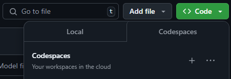
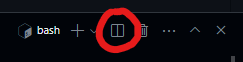
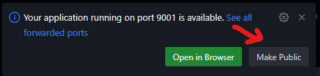
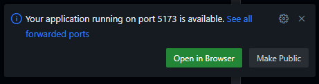
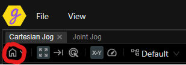

# Glowbuzzer React

This project contains the Glowbuzzer React source code, including example projects.

Glowbuzzer React allows you to quickly build a full featured machine control front-end running against our real time core, GBC.

You can start a full-featured demo using Github Codespaces, provided you have a Github account. Follow the steps below to start the demo:

## Create a Codespace
- Go to the Github repository https://github.com/glowbuzzer/gbr
- Switch branch to the demo you want to run. All demo branches are named `<demo-name>-demo` 

  

- Click the "Code" button and select the Codespaces tab

  

- Click the "+" button to create a Codespace on this branch. Note that it takes a while to start the codespace the first time

## Run the demo
When you start a Codespace, it opens a browser-based development environment. This is a virtualised environment that will run our real time control (GBC) and the development webserver which serves the GBR demo application.

You need to start the GBC and development webserver processes. To do so, follow these steps:

- In the terminal window, click the split terminal button to create a second terminal 

  

- In the first terminal, start GBC by typing:
    ```
    bash start-gbc.sh
    ```

    You will see a notification in the bottom right. Click the Make Public button 

    

- In the second terminal, start the development webserver by typing:
    ```
    pnpm start examples/machines/scara
    ```
    You will see a notification in the bottom right. Click Open in Browser 

    

- When the Scara demo application starts, you will be connected to the real time GBC control.

    To begin, start by moving the machine to the 'home' position by clicking the Home button. 
    
    This moves the machine away from the outstretched singularity.

    

    You can now use the cartesian and joint jog modes.

For more information, visit [glowbuzzer.com](https://www.glowbuzzer.com), or email hello@glowbuzzer.com.
