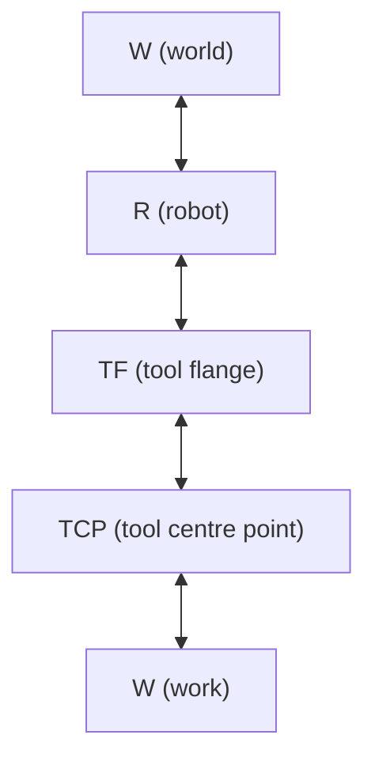
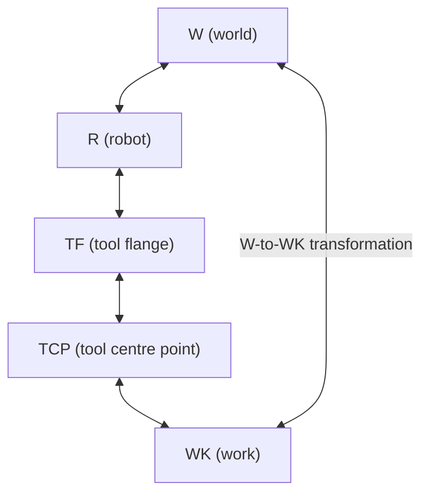
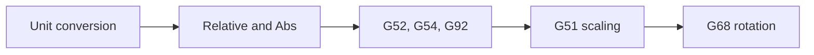

# Frames

## Frames and robots

Frames are name attached to the different coordinate systems used for different parts of a machine and its environment and the relationship between them. A Frame defines the position and orientation of one item with respect to another item with a given position and orientation.

The classic chain of frames for a robot is as follows.

The world frame W

  Between these frames transformations exist so that given a set of coordinates in (say) the work frame we wan work out the equivelnt coordinates in the (say) the world frame

## gcode & frames

gcode has its own concept of frames - its work and fixture offset commands.

