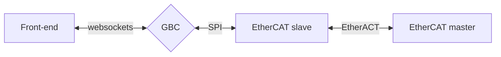
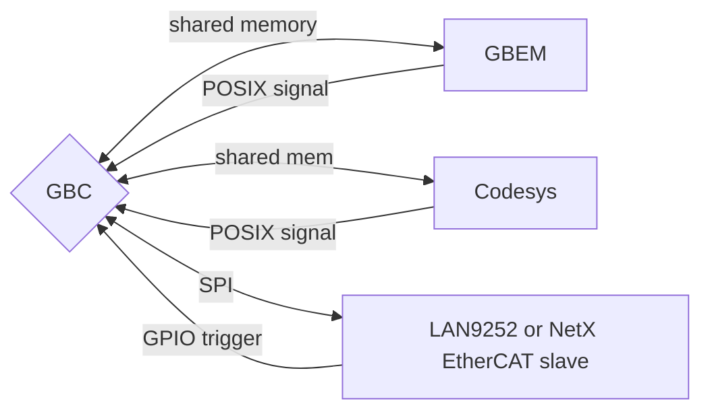

# GBC overview

## Introduction

GBC is the real-time control element of the glowbuzzer control suite.

GBC sends status messages and receives commands over websockets to/from the front-end control application.

The commands GBC receives are instructions to control the machine. A simple example would be `MoveLine` command which would be the instruction for a cartesian move on a machine. GBC receives this command and then computes the position commands that are needed to be sent to the motors (joints) using its trajectory planner. These joint commands are written to a shared memory region. 

Another process (GBEM or GBSM) reads this shared memory and is responsible for communicating with the actual EtherCAT slaves or motor drives and writing back status information to shared memory. 

For most scenarios GBC can be treated as a black box, websockets commands are sent to it and the correct data appears in the websockets status response and in the shared memory.

## Responsibilities of GBC

The key functions of GBC are:

* Reception and transmission of websocket messages
* Executing Tasks and Activities
* Some Activities Trajectory planning
* Forward & inverse kinematics
* Reading and writing to shared memory
* Processing inbound and outbound IO (digital ins / outs, integer ins / outs, float ins / outs)

## Deployment models for GBC

GBC can be integrated with the downstream (fieldbuses and IO and motors) in a number of different ways. These are illustrated below.


(A) GBC communicating with an EtherCAT slaves over an EtherCAT network through the GBEM EtherCAT master

(B) GBC communicating with motor drivers over SPI through the GBSM Step Master

(C) GBC communicating over SPI to EtherCAT slave IC and hence to an EtherCAT master


## Licensing

Many elements of the glowbuzzer control suite are supplied under an Open Source license but GBC is not. This is our licensed software and it may not be used without the customer entering into a license agreement with glowbuzzer. As we are independent of any hardware, licensing GBC is the company's main revenue stream.

## Supported platforms
GBC is written in plain c code. It has been tested on different 32-bit and 64-bit Linux versions and also on STM32 microcontrollers. We can compile libraries for different platforms such as QNX, VxWorks, INtime  and different microcontrollers on request.

### Linux

On Linux, GBC needs a multi core processor. Pretty much any desktop Intel/AMD processor will be sufficient and for embedded Linux a multi-core ARM Cortex-A series based SoC with the cores running at 1GHz will be adequate.

The platform GBC runs on will need al least two Ethernet/Wifi ports if GBC is being combined with GBEM (EtherCAT master). One for websockets and one for EtherCAT (two needed for cable redundant EtherCAT).

 If GBC is being used in an embedded Linux environment with motor driver ICs then only one Ethernet/WiFi port will be needed which is used to communicate over websockets to the front-end control (browser). 

### Microcontroller

We test GBC the STM32 platform. This is using ST's dual core ARM M7 / M4 range of microcontrollers. 

We see no difficulties getting GBC working on other manufacturers microcontrollers but it will likely need to be a dual-core microcontroller, though there may be an option to use two discrete microcontrollers connected over a high speed SPI interface. Either way, for a reasonable number of axes, the microcontroller will need to be in the highest performance range and support hardware floating point. GBC needs two cores because the web sockets server runs on one core and the real time control & fieldbus interface run on the other core. On Linux we use threads to distribute this workload but on slower speed microcontrollers this just isn't possible.

## Installation

### Linux

We provide binaries for 64-bit Linux and the Raspberry Pi for evaluation. These binaries can be found here [downloads](www.glowbuzzer.com/downloads).

### embedded

If you have an embedded requirement then please get in touch to talk further about how we can get you a compiled library for your toolchain.

## Running GBC

To run GBC usually `../GBC` is enough. You can optionally specify command line arguments of:

`-pPORT` and `-sSHARED_MEMORY_NAME` -`gSIGNAL` as command line arguments. Usually the default HTTP server `PORT` of 9001 and `SHARED_MEMORY_NAME` of "gbc_shared_mem" and `SIGNAL` of 29 (SIG I/O POSSIBLE) can be used.

To use GBC to control machines requires that the version of Linux used has the preempt patch must be installed on Linux. This is not needed to use GBC in simulation mode. Similarly GBC will not run in real-time on virtual machines but these can be used in simulation mode for development.

## Configuration of GBC

The configuration for GBC takes the form of a number JSON files placed in the same directory as the GBC binary. 

See [Configuration of GBC](configuration.md)

## Interfaces to GBC

### Shared memory

The shared memory is small in size (by default 200 bytes in /out though can be larger if needed) and contains the following data. 

IN region

```c
typedef struct {
    uint32_t machine_word; //the machine's overall status (CiA-402)
    uint32_t active_fault_word; //bits that define any active faults with the machine
    uint32_t fault_history_word; //bits that define any fault events that resulted in an error
    uint32_t  heartbeat; // a periodically increasing heartbeat used to detect we are connected
    uint16_t  joint_statusword[DPM_NUM_JOINTS]; //the CiA-402 status for drives
    int32_t joint_actual_position[DPM_NUM_JOINTS]; //actual position of the drives
    int32_t joint_actual_velocity[DPM_NUM_JOINTS]; //actual velocity of the drives
    int32_t joint_actual_torque[DPM_NUM_JOINTS]; //actual torque applied by the drives
    uint64_t digital; //state of upto 64 digital ins
    float analog[DPM_NUM_ANALOGS]; //state of float ins
    int32_t  integer32[DPM_NUM_INT32S]; //status of signed integers ins
    uint8_t reserved[4];
    uint32_t unsigned32[DPM_NUM_UINT32S]; //status of unsigned integer ins
}__attribute__((packed)) dpm_in_t;
```

OUT region

````c
typedef struct {
    uint32_t machine_word; // commanded (CiA-402) state of machine
    uint32_t hlc_control_word; // commands from the high-level-control to GBC
    uint32_t gbc_control_word; // commands from GBC to 
    uint32_t  heartbeat; // a periodically increasing heartbeat used to detect we are connected
    uint16_t  joint_controlword[DPM_NUM_JOINTS]; // CiA-402 control word for the drives (not used if say GBEM is commanding teh drives)
    int32_t joint_set_position[DPM_NUM_JOINTS]; // set position for drives (usually only this is used not velocity and torque)
    int32_t joint_set_velocity[DPM_NUM_JOINTS]; // set velocity for drives
    int32_t joint_set_torque[DPM_NUM_JOINTS]; // set torque for drives
    uint64_t digital; //commanded state for digital outs
    float analog[DPM_NUM_ANALOGS]; // commanded values for float outs
    int32_t  integer32[DPM_NUM_INT32S]; // commanded values for signed integer outs
    uint8_t reserved[4];
    uint32_t unsigned32[DPM_NUM_UINT32S]; // commanded values for unsigned integer outs
}__attribute__((packed)) dpm_out_t;
````

The shared memory operates the same across both Linux and microcontroller targets though in the case of the microcontroller it is expressed as a serial dual-port memory region accessed over SPI.

### Cyclic trigger - Linux

On Linux, as well as the shared memory interface, GBC requires either a POSIX signal or GPIO trigger to be received at the bus-cycle time (1ms, 2ms, 4ms etc.) to trigger the advance its cycle. This signal is by default number 29 `SIGIO` aka SIG I/O POSSIBLE.


### Cyclic trigger - microcontroller

This is usually an interrupt handler.

### Websockets interface

The websockets interface to GBC is used to issue commands and read status information from GBC.

This is documented here add_link.

## Javascript and GBC

GBC includes a JavaScript interpreter.

This allows end-user provided JavaScript to be executed cyclically, in near real-time.

This is a powerful feature of GBC. Examples of how it can be used include:

* (on a laser cutting machine) if the velocity of the TCP falls to zero automatically turn off the Digital Out controlling the laser
* di changes exec code

currently has task status change hool

`user.js` file is loaded if present and contains the JavaScript functions

faster response to events than the front-end code - 10-20ms

100ms front end

GBEM PLC functions

