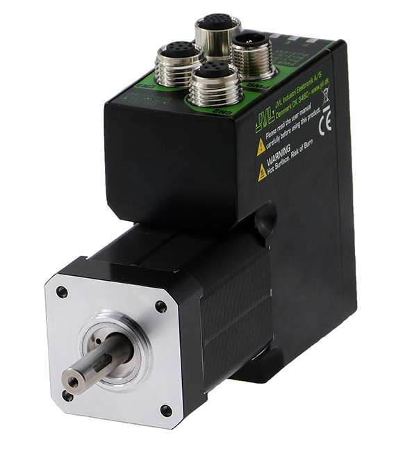
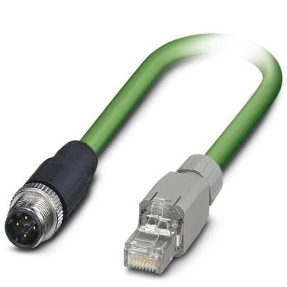
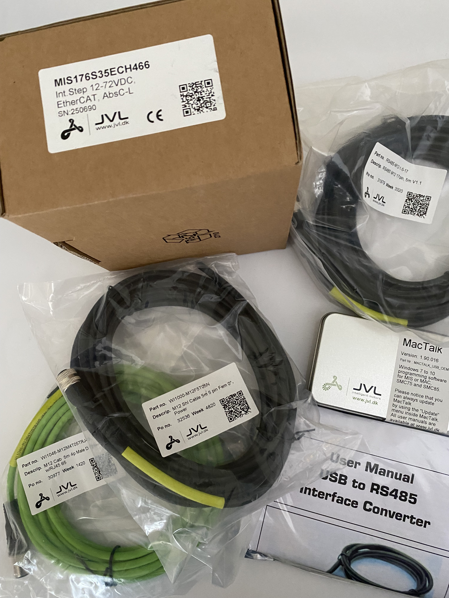
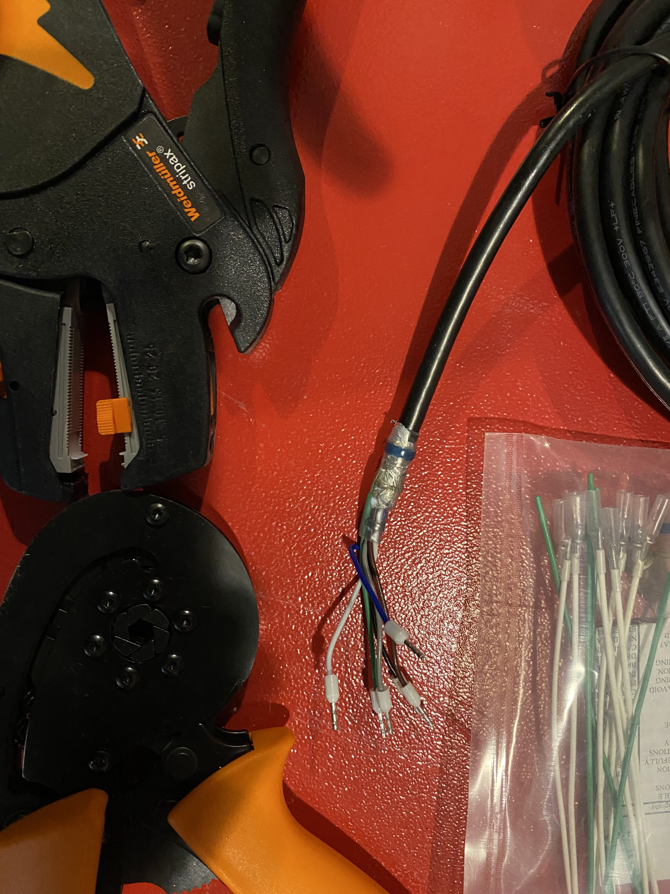
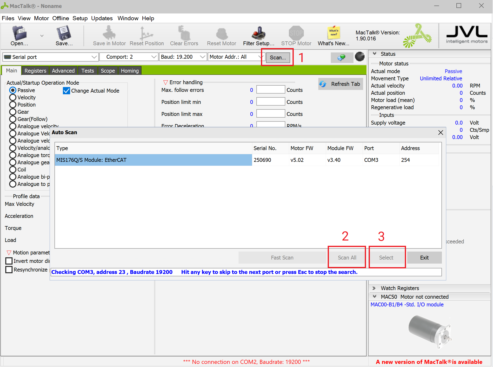
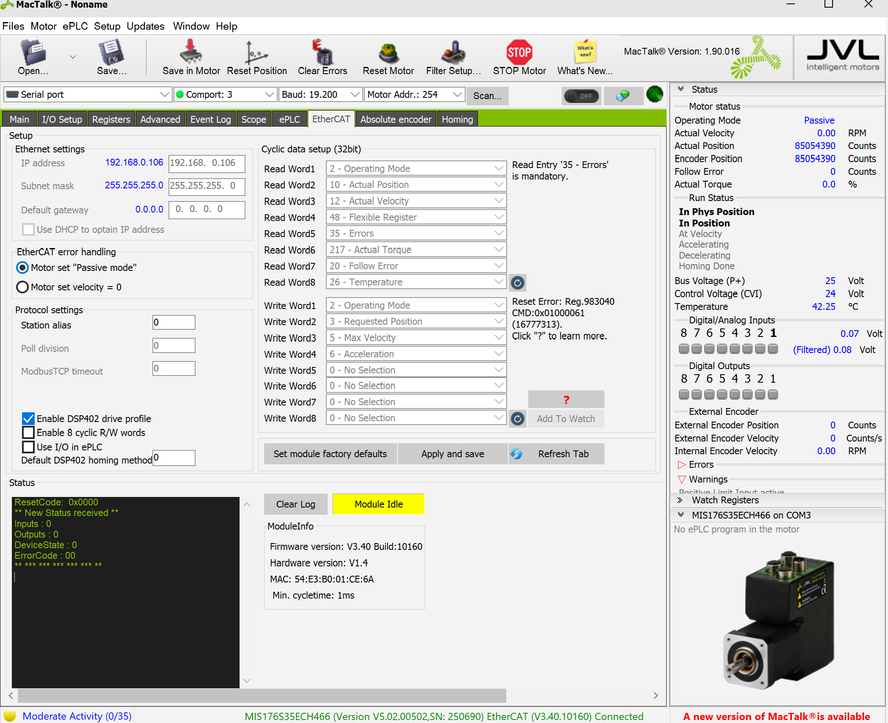
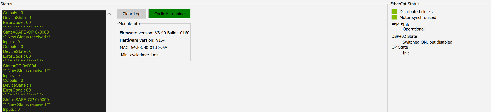

# ADDING SUPPORT FOR A JVL MIS DRIVE - BLOW-BY-BLOW
## Introduction
This tutorial will describe the process for adding support for a JVL MIS176S35ECH466 drive to GBEM.

The JVL MIS drives are integrated closed loop stepper motors. This means it has the motor drive electronics integrated into an enclosure built around the motor. 

These drives support multiple different Ethernet based fieldbus protocols:

* EtherCAT
* EtherNet/IP
* Profinet
* Powerlink
* Sercos

For this tutorial we will use the EtherCAT firmware. The switch between different fieldbus protocol is achieved by flashing different firmwares to the drive. EtherCAT is the default protocol that they are shipped from the factory flashed with.

The motor has four connectors:

* CN2 - Fieldbus IN/OUT - 4 pin M12 - this connects to your fieldbus
* CN3 - Fieldbus IN/OUT - 4 pin M12 - this also connects to your fieldbus
* CN1 - Power (PWR) - This is power for logic control (24V DC) which JVL call CVI (Control Voltage In) and P+ which is the main motor power (7-72V DC)  this is a 5 pin M12 connector
* CN4 - IO and RS485 - This is where the drive's digital and analog IO  are exposed on a 17 pin M12 connector

The drives look like this:



The motor uses 4 pin M12 connectors for its fieldbus. These are easily converted to the standard Ethernet Rj45 form with cables like these:



## What do you need to order?

### From JVL

| Part Number          | Short description | Long Description                                             |
| -------------------- | ----------------- | ------------------------------------------------------------ |
| MIS176S35ECH466      | Motor             | Int.Step 12-72VDC, EtherCAT, AbsC-L, Serie Nr.: 250690, 4xM12. 2x4pF:EtherCAT 17pF:8xDIO/AI+RS422+RS485, High Resolution: 409.600 step/rev. ±0.01 RPM, Programmable (incl. current, position & velocity), C-L + Abs Multiturn Enc. 4096/1024 CPR ± 5245, Revs, 8x24 w/ 3x10 KeyShaft: IP42 Motor: IP42, 43.1x106.0 mm Holding Torque: 0.80 Nm Radial, Connector 12-72 VDC Mechanical Power: 134 W |
| RS485-M12-1-5-17     | RS485 cable       | RS485 M12-17pin DSub, 5m v1.1, For ServoStep MIS17x...43x + SMC66/85 w/Ethernet, and MAC motor® w/Ethernet, MAC00-Ex41 |
| WI1000-M12F5T05N     | Power cable       | M12 Shl Cable 5m 5 pin Fem 0°, Power                         |
| WI1046-M12M4T05TRJ45 | Ethernet cable    | M12 Cab D-code Ethernet M0°-RJ45, 5m, Ø5                     |
| RS485-USB-ATC-820    | USB-RS485 adapter | USB to RS485 non-isolated adapter. 0,5m                      |
| MACTALK_USB_OEM      | MacTalk software  | MAC/MIS/SMC Win software+manuals USB8G                       |

### Miscellaneous items needed

Single 3A 24V PSU - for testing pretty much anything will do (switched mode or linear).  For desktop testing we use a MEANWELL GS220A24/GST220A24."brick" power supply.

Bootlace ferrules for the PSU wires.

Terminal blocks to connect the power supply to the drive. 

Screened cable sleeve (to terminate shield on motor power cable)

Tools: wire cutter, wire stripper, bootlace ferrule crimp tool.

## Unboxing

These are the components from the above BoM as delivered from JVL.



## MacTalk

JVL provide a piece of drive configuration software called MacTalk. This software is pretty much essential to commission a drive.

The MacTalk software talks to the drives through the RS485 serial protocol on the CN4 connector. This means the M12 17 pin cable connects to a RS485-to-USB converter and hence to the USB port on your PC.

MacTalk is supplied by JVL on a USB stick and you will need to install it on your PC. This is Windows only software. We had a bit of trouble with our anti-virus software falsely flagging one of the MacTalk files and had to add it to the whitelist.

## Step 1 - Wiring up the motor

### Power supply selection

The drive has two power supply connections:

* CVI - logic power - 7-30V - 200mA
* P+ motor power - 7-72V - 24v @ 70w = 3A

The power supply connector wiring coluors (using the JVL manufactured power cable) are as follows

* Brown and white = p+

* Black = cv

* blue and grey = GND (0V)

JVL make their own PSU and you can use these or for testing, we can get away with using a single power supply, in this case we used a 24v 9A "brick" switch mode power supply that is handy for desktop use (MEANWELL GS220A24/GST220A24 ) and we can get away with using one power supply for both CV and P+.

For production use an use with multiple drives you are going to need to have separate PSUs for motor and logic power and you need to consult the JVL manual for details of the power supply characteristics.

### Power cable preparation

The bare wire end of the power cable will need a bit of preparation before use.  The power supply cable needs crimping and also the braided screen terminating so that we can ground the end of the cable screen.



### Power cable plugged into power supply and motor

pic

## Step 2 - Connect to the motor from MacTalk software

The aim of this step is to make sure that we can talk to the motor from MacTalk.

1. Connect motor power and turn on. The LEDs on the front of the motor should produce a natty night rider strobe effect.
2. Turn off power to the motor and then connect CN4 to the USB-to-RS485 converter.
3. Plug in the USB cable from the USB-to-RS485 converter to your PC and turn on the power to motor on again.
5. Run the MacTalk software
6. Click "Scan" (1) in top bar of the software (after selecting the right COM port) and then in the window that appears, click "Scan All" (2) then select the motor with the "Select" (3) button.



The first test involved turning the motor shaft by hand. The Actual Position value shown in the right hand panel should change. That is pretty good confirmation that MacTalk is talking to the drive.

The next steps involve making sure the drive is configured the correct way to support the rest of our configuration steps.

1. Go to the EtherCAT screen in MacTalk
2. Check "Enabled DSP402 drive profile" is selected



It is also useful but not essential to upgrade the firmware on the drive. This is accessed through the "Updates" top drop down menu.

## Step 3 - connect the drive to GBEM and run netscan

Now we disconnect the RS485-to-USB converter and connect the drive to GBEM running on a Linux platform with an M12-Ethernet cable from the CN2/3 to the Ethernet port on the Linux host. Power up the drive again.

The we run `gbem -n -ieth0`. And this should produces the following output:

````shell
PDO mapping according to CoE :
  SM2 outputs
        [byte_offset] [addr b  ]     [index:sub  ] [bitl] [data_type   ] [name                                    ]
        [0          ] [0xFFF8F260.0] [0x6040:0x00] [0x10] [UNSIGNED16  ] [Control word                            ]
        [2          ] [0xFFF8F262.0] [0x607A:0x00] [0x20] [INTEGER32   ] [Target position                         ]
        [6          ] [0xFFF8F266.0] [0x0000:0x00] [0x00]
        [6          ] [0xFFF8F266.0] [0x0000:0x00] [0x00]
        [6          ] [0xFFF8F266.0] [0x0000:0x00] [0x00]
        [6          ] [0xFFF8F266.0] [0x0000:0x00] [0x00]
        [6          ] [0xFFF8F266.0] [0x0000:0x00] [0x00]
        [6          ] [0xFFF8F266.0] [0x0000:0x00] [0x00]
  SM3 inputs
        [byte_offset] [addr b  ]     [index: sub ] [bitl] [data_type   ] [name                                    ]
        [0          ] [0xFFF8F260.0] [0x6041:0x00] [0x10] [UNSIGNED16  ] [Status word                             ]
        [2          ] [0xFFF8F262.0] [0x6064:0x00] [0x20] [INTEGER32   ] [Position actual value                   ]
        [6          ] [0xFFF8F266.0] [0x0000:0x00] [0x00]
        [6          ] [0xFFF8F266.0] [0x0000:0x00] [0x00]
        [6          ] [0xFFF8F266.0] [0x0000:0x00] [0x00]
        [6          ] [0xFFF8F266.0] [0x0000:0x00] [0x00]
        [6          ] [0xFFF8F266.0] [0x0000:0x00] [0x00]
        [6          ] [0xFFF8F266.0] [0x0000:0x00] [0x00]
````

This output from netscan shows us the default PDO mapping on the drive. It is ok, we could work with this. There is a control word and status word and setPos and actPos and with those variables you can get a drive to move. But we would like more!

The things that stand out as missing are:

* An error code that we can decode to see what is going on in the drive if it has problems

* A way to set and check Modes of Operation (MOO)

It would also be nice to get a value for the drive's follow error and actual velocity and torque.

Looking in the drive's instruction manual, we can see that it doesn't support different pre-configured PDO layouts. With this drive: 

* SM2 - 0x1c12 is permanently assigned to 0x1600
* SM3 - 0x1c13 is permanently assigned to 0x1a00

So with this drive we can't assign additional PDO objects to SM2 and SM3 but we can can insert additional objects to the PDO content held at 0x1600 and 0x1a00.

So, we will do a custom PDO mapping (a.k,a. flexible PDO mapping). Diving into the manual, we can get the addresses for the additional objects and we can lay out the PDO mapping we want.

From the drive's manual, we can layout the objects in the RxPDO and TxPDO.

**RxPDO**

- 0x6040:0/16 bits - CiA 402 control world

- 0x6060:0/8 bits - set modes of operation (MOO SET)

- 0x607A:0/32 bits - set position (setPos)

**TxPDO**

- 0x6041:0/16 bits - CiA 402 status word
- 0x6061:0/8 bits - display modes of operation (MOO DISP)
 - 0x6064:0/32 bits - position actual value (actPos)
 - 0x606c:0/32 bits - velocity actual value (actVel)
 - 0x6077:0/16 bits - torque actual vlaue (actAcc)
 - 0x60f4:0/32 bits - follow error actual value
 - 0x603f:0/16 bits - error code

There is a limit on the JVL drives that the PDO can contain a **MAXIMUM** of 8 entries so take care. 

So, let's add the c code needed to do the PDO mapping. Add a new directory in `/libs` called `JVL` and inside this directory create `src` and `inc` sub-directories and inside `src` create a c file called `jvl_mis.c` and inside the `inc` directory a header file called `jvl_mis.h`. Then add a `CMakeLists.txt` file to the `JVL` directory. 

````cmake
cmake_minimum_required(VERSION 3.5)

project(JVL C)

file(GLOB SOURCES "src/*.c")

add_library(JVL STATIC ${SOURCES})
target_link_libraries(JVL common-misc Logging machine_mapping EtherCAT)
target_include_directories(JVL PUBLIC inc)
````

Also add the `add_subdirectory("libs/JVL")` to root `CMakeLists.txt` and add `JVL` to the `target_link_libraries` in GBEM's `CMakeLists.txt`

SM2 is the RxPDO and is Outputs (things like Control Word and setPos)

SM3 is the TxPDO and is Inputs (things like Status Word and actPos)

From our list above, the RxPDO (SM2) has 3 entries & the TxPdo (SM3) has 7 entries

So we can add this code to our `jvl_mis.c` file.

````c
map_PDO_configuration_object_t map_rxpdo_object_jvl_mis = {
        .number_of_entries = 3,
        .PDO_assignment_index = 0x1600
};

map_PDO_configuration_object_t map_txpdo_object_jvl_mis = {
        .number_of_entries = 7,
        .PDO_assignment_index = 0x1a00
};
````

And then this:

```c
uint32_t map_rxpdo_contents_jvl_mis[ECM_MAX_PDO_MAPPING_ENTRIES] = {
        0x60400010,
        0x60600008,
        0x607A0020};

uint32_t map_txpdo_contents_jvl_mis[ECM_MAX_PDO_MAPPING_ENTRIES] = {
        0x60410010,
        0x60610008,
        0x60640020,
        0x606c0020,
        0x60770010,
        0x60f40020,
        0x603f0010,
};
```

The meaning of the data (for example 0x60410010 in the mapping of 0x1A00 sub 1) is as follows:

- 0x6041 is the index of the CiA-402 statusword.
- 0x00 is the sub-index of the CiA-402 statusword.
- 0x10 is the number of bits for this entry, i.e. 16 bits or 2 bytes.

Now let's write the actual function to perform the SDO writes to create the PDO mapping from the data we defined in the structs and arrays above.

First, it must write zeros to the assignment indexes, then it loops over the number of entries in the arrays of objects and writes these and finally it writes the total numbers of entries. It does this for SM2 and SM3 separately.

```c
gberror_t ec_pdo_map_jvl_mis(const uint16_t slave) {

    /* clear TxPdo 0x1a00 */
    if (!ec_sdo_write_uint8(slave, map_txpdo_object_jvl_mis.PDO_assignment_index, 0, 0)) {
        return E_SDO_WRITE_FAILURE;
    }

    /* write contents of TxPdo */
    for (int i = 0; i < map_txpdo_object_jvl_mis.number_of_entries; i++) {
        if (!ec_sdo_write_uint32(slave, map_txpdo_object_jvl_mis.PDO_assignment_index, i + 1, map_txpdo_contents_jvl_mis[i])) {
            return E_SDO_WRITE_FAILURE;
        }
    }

    /* write number of entries in TxPdo 0x1a00 */
    if (!ec_sdo_write_uint8(slave, map_txpdo_object_jvl_mis.PDO_assignment_index,0,map_txpdo_object_jvl_mis.number_of_entries)){
        return E_SDO_WRITE_FAILURE;
    }

    /* clear RxPdo 0x1600 */
    if (!ec_sdo_write_uint8(slave, map_rxpdo_object_jvl_mis.PDO_assignment_index, 0, 0)) {
        return E_SDO_WRITE_FAILURE;
    }

    /* write contents of RxPdo */
    for (int i = 0; i < map_rxpdo_object_jvl_mis.number_of_entries; i++) {
        if (!ec_sdo_write_uint32(slave, map_rxpdo_object_jvl_mis.PDO_assignment_index, i + 1, map_rxpdo_contents_jvl_mis[i])) {
            return E_SDO_WRITE_FAILURE;
        }
    }

    /* write number of entries in RxPdo 0x1600 */
    if (!ec_sdo_write_uint8(slave, map_rxpdo_object_jvl_mis.PDO_assignment_index,0,map_rxpdo_object_jvl_mis.number_of_entries)){
        return E_SDO_WRITE_FAILURE;
    }

//all applied correctly
    return E_SUCCESS;
}
```

 Next we need to create a new machine inside GBEM with which to test the motor. Inside `/libs/machine_mapping/src/machines` create a c file called `jvl_mis_test_map.c` and inside `/libs/machine_mapping/inc/machines` create a c file called `jvl_mis_test_map.h`.

Inside `jvl_mis_test_map.c` we can start by defining the slave functions and parameters. We only have one slave / drive in our test machine just the JVL drive. We will add the link PDO mapping function we just wrote in `MAP_SLAVE_PDO_MAPPING_FUNCTIONS` .

```c
//                                        Slave 1
//                                        MAP_JVL_MIS_1
//                                        Drive
MAP_NUM_DRIVES_ATTACHED(                  1                     			);
MAP_SLAVE_PDO_MAPPING_FUNCTIONS(          ec_pdo_map_jvl_mis    			);
MAP_SLAVE_NVRAM_SDO_FUNCTIONS(            NULL         						);
MAP_SLAVE_STANDARD_SDO_FUNCTIONS(         ec_standard_sdos_jvl_mis			);
MAP_SLAVE_INITIAL_PDO_FUNCTIONS(          ec_initial_pdo_jvl_mis   			);
MAP_SLAVE_DC_TYPE(                        EC_DC_0,              			);
```

We can see that we will need a function called `ec_standard_sdos_jvl_mis`to apply the standard SDOs so we can create an empty function in `jvl_mis.c` with the signature `gberror_t ec_standard_sdos_jvl_mis(const uint16_t slave)`that we will implement when we have worked out what SDOs we need to write to the drive at start-up.

Also, because we added the Modes of Operation to the PDO mapping we will set the modes-of-operation with an initial PDO write so we will need an `ec_initial_pdo_jvl_mis` function in `jvl_mis.c` with a signature of `gberror_t ec_initial_pdo_jvl_mis(const uint16_t slave)`.

From reading the drive's manual, we know that the drive supports using DC 0 distributed clock so we can set this here in `MAP_SLAVE_DC_TYPE`.

And then we can add the following to `jvl_mis_test_map.c`.

```C
/* DRIVES */
MAP_DRIVE_TO_NAME(                          "JVL1"                          );
MAP_DRIVE_TO_SLAVE(                         MAP_JVL_MIS_1                   );
MAP_DRIVE_TO_SUBDRIVE(                      1                               );
MAP_DRIVE_GET_MOO_PDO_FUNCTIONS(            ec_get_moo_pdo_jvl_mis          );
MAP_DRIVE_GET_MOO_SDO_FUNCTIONS(            NULL                            );
MAP_DRIVE_GET_REMOTE_FUNCTIONS(             ec_get_remote_jvl_mis           );
MAP_DRIVE_GET_FOLLOW_ERROR_FUNCTIONS(       ec_get_follow_error_jvl_mis     );
MAP_DRIVE_GET_ERROR_STRING_PDO_FUNCTIONS(   NULL                            );
MAP_DRIVE_GET_ERROR_STRING_SDO_FUNCTIONS(   ec_get_error_string_sdo_jvl_mis );
MAP_DRIVE_SET_CTRL_WRD_FUNCTIONS(           ec_set_ctrl_wrd_jvl_mis         );
MAP_DRIVE_GET_STAT_WRD_FUNCTIONS(           ec_get_stat_wrd_jvl_mis         );
MAP_DRIVE_GET_ACTPOS_WRD_FUNCTIONS(         ec_get_actpos_wrd_jvl_mis       );
MAP_DRIVE_SET_SETPOS_WRD_FUNCTIONS(         ec_set_setpos_wrd_jvl_mis       );
MAP_DRIVE_HOMING_EXEC_FUNCTIONS(            NULL                            );
MAP_DRIVE_RUN_HOMING(                       0                               );
MAP_DRIVE_PRINT_PARAMS_FUNCTIONS(           ec_print_params_jvl_mis         );
```

We can set a name for the drive using `MAP_DRIVE_TO_NAME`. This appears in the console output in various places.

This drive just supports a single drive on each slave so `MAP_DRIVE_TO_SUBDRIVE` is set to 1.

Because we added the Modes of Operation to the PDO mapping we did earlier we know that we will use the `MAP_DRIVE_GET_MOO_PDO_FUNCTIONS` rather than `MAP_DRIVE_GET_ERROR_STRING_SDO_FUNCTIONS`.

Because we added follow error to the PDO mapping we know we need a `MAP_DRIVE_GET_FOLLOW_ERROR_FUNCTIONS` to read the PDO object containing the value of the follow error and decide if it is over the threshold that constitutes a follow-error.

`MAP_DRIVE_SET_CTRL_WRD_FUNCTIONS` will write the control word to the PDO object.

`MAP_DRIVE_GET_STAT_WRD_FUNCTIONS` will read the status word from the PDO object. 

`MAP_DRIVE_GET_ACTPOS_WRD_FUNCTIONS` will read the actual position from the PDO object.

`MAP_DRIVE_SET_SETPOS_WRD_FUNCTIONS` will write the set position to the PDO object.

We will not need a `MAP_DRIVE_HOMING_EXEC_FUNCTIONS` as our drive has a nifty absolute multiturn encoder so we are spared the pain of using the the on-drive switch based homing functions.

So we can create function declarations in the `jvl_mis.h` and function definitions in `jvl_mis.c `for all the functions we need. 

```c
gberror_t ec_pdo_map_jvl_mis(uint16_t slave);
gberror_t ec_initial_pdo_jvl_mis(uint16_t slave);
int8_t ec_get_moo_pdo_jvl_mis(uint16_t drive);
bool ec_get_remote_jvl_mis(uint16_t drive);
bool ec_get_follow_error_jvl_mis(uint16_t drive);
uint8_t *ec_get_error_string_pdo_jvl_mis(uint16_t drive);
int32_t ec_get_actpos_wrd_jvl_mis(uint16_t drive);
gberror_t ec_set_ctrl_wrd_jvl_mis(uint16_t drive, uint16_t ctrlwrd);
uint16_t ec_get_stat_wrd_jvl_mis(uint16_t drive);
gberror_t ec_set_setpos_wrd_jvl_mis(uint16_t drive, int32_t setpos);
gberror_t ec_print_params_jvl_mis(uint16_t drive); 
```

We can leave the function bodies empty apart from the `ec_pdo_map_jvl_mis` function to begin with as what we want to do first is just test the PDO mapping and not bother with all the other functions.

But before we can do this test, we need to set a few things up so that we can run the machine we have defined.

In `machine_mapping/src/machines/map_config.c`  add the name of the machine to `const char *map_machine_type_strings[]` i.e. "MACHINE_JVL_MIS_TEST"

In `map_config.h` add and new #define toggle to enable and disable this machine configuration:

```c
#define MACHINE_EL7211_TEST         0
#define MACHINE_TEST                0
#define MACHINE_JVL_MIS_TEST        1
```

And also in this file add the follow entry to the enum of all machine types:

```c
typedef enum {
  	other entries...
    MAP_MACHINE_JVL_MIS_TEST,
} map_machine_type_t;
```

And finally conditionally include the header file we created when the #define == 1.

```c
#if MACHINE_JVL_MIS_TEST == 1
#include "jvl_mis_test_map.h"
#endif
```

In `main.c`, add a new entry so that the variable map_machine_type is set to value of the machine type enum when the machine is #defined. This is only so that when GBEM starts the machine type is outputted to console. This is surprisingly useful as many an hour has been lost trying to diagnose problems when the wrong machine has been #defined...

```c
#if MACHINE_JVL_MIS_TEST == 1
    map_machine_type = MAP_MACHINE_JVL_MIS_TEST;
#endif
```

Now we can come back to to a drive header file, `jvl_mis.h`, and here we need to add our variable definitions for the PDO mapping objects:

```c
map_PDO_configuration_object_t map_txpdo_object_jvl_mis;
map_PDO_configuration_object_t map_rxpdo_object_jvl_mis;

uint32_t map_rxpdo_contents_jvl_mis[ECM_MAX_PDO_MAPPING_ENTRIES];
uint32_t map_txpdo_contents_jvl_mis[ECM_MAX_PDO_MAPPING_ENTRIES];
```

And finally declarations for the functions we created need adding to `jvl_mis.h`.

```c
gberror_t ec_pdo_map_jvl_mis(uint16_t slave);
gberror_t ec_initial_pdo_jvl_mis(uint16_t slave);
int8_t ec_get_moo_pdo_jvl_mis(uint16_t drive);
bool ec_get_remote_jvl_mis(uint16_t drive);
bool ec_get_follow_error_jvl_mis(uint16_t drive);
uint8_t *ec_get_error_string_pdo_jvl_mis(uint16_t drive);
int32_t ec_get_actpos_wrd_jvl_mis(uint16_t drive);
gberror_t ec_set_ctrl_wrd_jvl_mis(uint16_t drive, uint16_t ctrlwrd);
uint16_t ec_get_stat_wrd_jvl_mis(uint16_t drive);
gberror_t ec_set_setpos_wrd_jvl_mis(uint16_t drive, int32_t setpos);
gberror_t ec_print_params_jvl_mis(uint16_t drive); 
```

As we only have a single slave on our EtherCAT network (the drive) we can't define an estop digital input so we need to disabled this in `gbem_config.h` with the #define:

```c
#define DISABLE_ESTOP_CHECKING                          1
```

Now we can run netscan again, this time with the `-m` option - `gbem -m -ieth0`. The -m option runs the PDO mapping function we just wrote before doing the scan of the network. If you have the wind on your back, your should see:

````c
PDO mapping according to CoE :
  SM2 outputs
        [byte_offset] [addr b  ] [index:sub  ] [bitl] [data_type   	   ] [name                                    ]
        [0          ] [0xFFF8BFB0.0] [0x6040:0x00] [0x10] [UNSIGNED16  ] [Control word                            ]
        [2          ] [0xFFF8BFB2.0] [0x6060:0x00] [0x08] [INTEGER8    ] [Modes of operation                      ]
        [3          ] [0xFFF8BFB3.0] [0x607A:0x00] [0x20] [INTEGER32   ] [Target position                         ]
  SM3 inputs
        [byte_offset] [addr b  ] [index: sub ] [bitl] [data_type       ] [name                                    ]
        [0          ] [0xFFF8BFB0.0] [0x6041:0x00] [0x10] [UNSIGNED16  ] [Status word                             ]
        [2          ] [0xFFF8BFB2.0] [0x6061:0x00] [0x08] [INTEGER8    ] [Operation mode display                  ]
        [3          ] [0xFFF8BFB3.0] [0x6064:0x00] [0x20] [INTEGER32   ] [Position actual value                   ]
        [7          ] [0xFFF8BFB7.0] [0x606C:0x00] [0x20] [INTEGER32   ] [Velocity actual value                   ]
        [11         ] [0xFFF8BFBB.0] [0x6077:0x00] [0x10] [INTEGER16   ] [Torque actual value                     ]
        [13         ] [0xFFF8BFBD.0] [0x60F4:0x00] [0x20] [INTEGER32   ] [Following error actual value            ]
        [17         ] [0xFFF8BFC1.0] [0x603F:0x00] [0x10] [UNSIGNED16  ] [Error code                              ]
````

Hooray! We have our PDO mapping successfully applied. We deserve a 🥇 for that work.

Now we need to create some #defines for our PDO objects. We try and keep things simple and just use the byte offsets for the PDO objects. This is just taken from the netscan output above and pasted into #defines you create in the `jvl_mis.h` file.

````c
//SM2
#define JVL_MIS_CONTROLWORD_PDO_INDEX       0
#define JVL_MIS_MOOSET_PDO_INDEX            2
#define JVL_MIS_SETPOS_PDO_INDEX            3

//SM3
#define JVL_MIS_STATUSWORD_PDO_INDEX        0
#define JVL_MIS_MOODISP_PDO_INDEX           2
#define JVL_MIS_ACTPOS_PDO_INDEX            3
#define JVL_MIS_ACTVEL_PDO_INDEX            7
#define JVL_MIS_ACTACC_PDO_INDEX            11
#define JVL_MIS_ACTFOLLOWWERROR_PDO_INDEX   13
#define JVL_MIS_ERROR_CODE_PDO_INDEX        17
````

Also this is a good point to add the #defines for some SDO objects we will need:

```c
//SDOs
//int32
#define JVL_MIS_POS_POSLIMIT_SDO_INDEX      0x607d
#define JVL_MIS_POS_POSLIMIT_SDO_SUB_INDEX  2

//int32
#define JVL_MIS_NEG_POSLIMIT_SDO_INDEX      0x607d
#define JVL_MIS_NEG_POSLIMIT_SDO_SUB_INDEX  1

//uint8
#define JVL_MIS_DIRECTION_SDO_INDEX         0x607e
#define JVL_MIS_DIRECTION_SDO_SUB_INDEX 0
```


then write the functions

### `ec_get_remote_jvl_mis`

```
bool ec_get_remote_jvl_mis(const uint16_t drive) {

    uint16_t drive_stat_wrd;

    drive_stat_wrd = ec_get_stat_wrd_jvl_mis(drive);

    if (BIT_CHECK(drive_stat_wrd, CIA_REMOTE_BIT_NUM)) {
        return true;
    }
    return false;

}
```


```
gberror_t ec_standard_sdos_jvl_mis(const uint16_t slave) {

    if (!ec_sdo_write_int32(slave, JVL_MIS_POS_POSLIMIT_SDO_INDEX, JVL_MIS_POS_POSLIMIT_SDO_SUB_INDEX, map_drive_pos_limit[slave])) {
        return E_SDO_WRITE_FAILURE;
    }

    if (!ec_sdo_write_int32(slave, JVL_MIS_NEG_POSLIMIT_SDO_INDEX, JVL_MIS_NEG_POSLIMIT_SDO_SUB_INDEX, map_drive_neg_limit[slave])) {
        return E_SDO_WRITE_FAILURE;
    }

    if (!ec_sdo_write_int32(slave, JVL_MIS_DIRECTION_SDO_INDEX,
                            JVL_MIS_DIRECTION_SDO_SUB_INDEX, map_drive_direction[slave])) {
        return E_SDO_WRITE_FAILURE;
    }

    return E_SUCCESS;
}
```


```
int8_t ec_get_moo_pdo_jvl_mis(const uint16_t drive) {
    return ec_pdo_get_input_int8(map_drive_to_slave[drive], JVL_MIS_MOODISP_PDO_INDEX);
}
```


```
gberror_t ec_initial_pdo_jvl_mis(const uint16_t slave) {
    ec_pdo_set_output_int8(slave, JVL_MIS_MOOSET_PDO_INDEX, CIA_MOO_CSP);
    return E_SUCCESS;
}
```

```
bool ec_get_remote_jvl_mis(const uint16_t drive) {
    uint16_t drive_stat_wrd;
    drive_stat_wrd = ec_get_stat_wrd_jvl_mis(drive);
    if (BIT_CHECK(drive_stat_wrd, CIA_REMOTE_BIT_NUM)) {
        return true;
    }
    return false;
}
```


```
#define JVL_MIS_FOLLOWERROR_TOLERANCE 20000

bool ec_get_follow_error_jvl_mis(const uint16_t drive) {
    int32_t follow_error = abs(ec_pdo_get_input_int32(map_drive_to_slave[drive], JVL_MIS_ACTFOLLOWWERROR_PDO_INDEX));

    if (follow_error>JVL_MIS_FOLLOWERROR_TOLERANCE){
        return true;
    }
    return false;

}
```


```
#define NUM_OF_JVL_MIS_ERROR_STRINGS 20

const jvl_mis_error_string_t jvl_mis_alarm_code[NUM_OF_JVL_MIS_ERROR_STRINGS] = {
        {0, "No error"},
        {16912, "Temperature too high"},
        {21376,"Initialization error"},
        {30081,"Initialization error"},
        {34321,"Follow erro"},
        {34432,"SW position limit exceeded"},
        {12832,"Undervoltage on bus<"},
        {29446,"Multiturn encoder lost position"},
        {29447,"Multiturn encoder reed error"},
        {29448,"Multiturn encoder communication error"},
        {30080,"SSI Encoder error"},
        {33921,"SSI Encoder error"},
        {21889,"Memory error"},
        {29445,"Singleturn encoder error"},
        {21377,"STO alarm error"},
        {34433,"Negative limit exceeded<"},
        {34434,"Positive limit exceeded"},
};

uint8_t *ec_get_error_string_pdo_jvl_mis(const uint16_t drive) {
    static uint8_t error_code_string[MAX_DRIVE_ERROR_MSG_LENGTH];
    memset(&error_code_string[0], 0, sizeof(uint8_t) * MAX_DRIVE_ERROR_MSG_LENGTH);
    uint16_t drive_error_code = 0;
    drive_error_code = ec_pdo_get_input_uint16(map_drive_to_slave[drive], JVL_MIS_ERROR_CODE_PDO_INDEX);

    for (int i = 0; i < NUM_OF_JVL_MIS_ERROR_STRINGS; i++) {
        if (jvl_mis_alarm_code[i].error_id == drive_error_code) {
            strncpy(&error_code_string[0], jvl_mis_alarm_code[i].text_string, sizeof(error_code_string) - 1);
            break;
        }
    }
    return error_code_string;
}
```


```
int32_t ec_get_actpos_wrd_jvl_mis(const uint16_t drive) {
    return ec_pdo_get_input_int32(map_drive_to_slave[drive], JVL_MIS_ACTPOS_PDO_INDEX);
}
```


```
gberror_t ec_set_ctrl_wrd_jvl_mis(const uint16_t drive, const uint16_t ctrlwrd) {
    ec_pdo_set_output_uint16(map_drive_to_slave[drive], JVL_MIS_CONTROLWORD_PDO_INDEX, ctrlwrd);
    return E_SUCCESS;
}
```


```
uint16_t ec_get_stat_wrd_jvl_mis(const uint16_t drive) {
    return ec_pdo_get_input_uint16(map_drive_to_slave[drive], JVL_MIS_STATUSWORD_PDO_INDEX);
}
```


```
gberror_t ec_set_setpos_wrd_jvl_mis(const uint16_t drive, const int32_t setpos) {
    ec_pdo_set_output_int32(map_drive_to_slave[drive], JVL_MIS_SETPOS_PDO_INDEX, setpos);
    return E_SUCCESS;
}
```


from the netscan

 Vendor ID        : 00000117
 Product Code     : 00000201
 Revision Number  : 0000001D
 Serial Number    : 00010562

MISxxx with CiA402, DC

add this to`jvl_mis.h`

```c
#define JVL_MAN 0x2BE
#define JVL_MIS_EEP_NAME "MISxxx with CiA402, DC"
#define JVL_MIS_EEP_MAN JVL_MAN
#define JVL_MIS_EEP_REV 0x1d
#define JVL_MIS_EEP_ID 0x201
```


## GBC config

Need to create a JSON file

`machine_jvl_mis_test.json`


??? need to add details of how to install this file once we have this worked out

## Testing the drive

1. run `gbem -m -ieth0` to check the PDO mapping again
2. run `gbem -d -ieth0` to check the config. This should complete without any errors.

3. run `gbem -c -ieth0` and in parallel run `gbc`
4. run the front-end web app and see if you can jog the motor from the commissioning UI
5. run MacTalk in parallel look for sync in MacTalk. This is the green "leds" marked "Distributed clocks" & "Motor synchronised"  in the following screen shot:




## 32-bit DC reference clock

Once you test the drive, you are likely to find that the drive works ok but every few seconds the drive judders.

This needs fixing!

The origin of the problem is the drive's support for a 32-bit DC reference clock rather than the more usual 64 bits

During GBEM boot you may have noticed a warning from the function `check_dc_clock_type` saying the the JVL drive only supported a 32 bit DC reference clock. A 32 bit register holding a nanoseconds time overflows in 4-or-so seconds and this is causing the juddering issue.

GBEM establishes synchronisation with slave number 1 on EtherCAT network. If this slave supports a 64 bit clock then the other slaves will sync with this. So the easiest fix is to have slave number 1 support a 64 clock. Inserting say an EK1100 module into the network in position 1 and having the drive as slave number 2 fixes the issue.

## Scaling the drive

Scaling takes place in two places:


In `machine_jvl_mis_test.json`in :

```json
"joint": {
  "0": {
    "vmax": 500,
    "amax": 2000,
    "jmax": 4000,
    "scale": 1000
  },
```


Using the SDO objects on the drive:

| Index  | Sub-index | Name              | Type | Attr. | Default |
| ------ | --------- | ----------------- | ---- | ----- | ------- |
| 0x6091 | 0         | Gear ratio        | U8   | RO    | 2       |
| 0x6091 | 1         | Motor revolutions | U32  | RW    | 1       |
| 0x6091 | 2         | Shaft revolutions | U32  | RW    | 1       |
| 0x6092 | 0         | Feed constant     | U8   | RO    | 2       |
| 0x6092 | 1         | Feed              | U32  | RW    | 409600  |
| 0x6092 | 2         | Shaft revolutions | U32  | RW    | 1       |


in teh CMakeList.txt for machine_mapping add the JVL to the target_link_libraries() section
