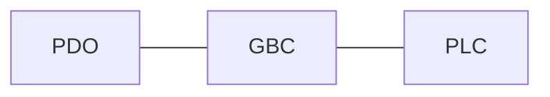

# CONFIGURING MACHINES

## Introduction

You can use GBEM without writing any new c code if you work with the types of drives/slaves we have pre-configured. These include a a range of slaves from Beckhoff, Oriental Motor, JVL, Kollmorgen, Panasonic, Omron, Delta, Cannon, nanotec, Trinamic, Delta etc. (see [DRIVE SUPPORT](drive_support.md)).

If you want to add support for new slaves from different manufacturers then some very basic c programming know-how is needed - see [ADDING A NEW SLAVE](adding_a_new_slave.md) &  [ADDING A NEW DRIVE](adding_a_new_drive.md).

If you are using the pre-configured drives/slaves (or have already written your drive / slave interfaces) the steps involved in creating a machine configuration are:

1. Create a new pair of machine .h and .c files (`mymachine_map.c` & `mymachine_map.h`that will hold the configuration of your new machine [Step 1](#Step 1)
2. Edit the `map_config` files to add in a #define for your new machine [Step 2](#Step 2 )
3. Add links in the new `mymachine_map.c` file to existing functions for slave configuration [Step 3](#Step 3)
4. Add links in the `mymachine_map.c` file to existing functions for drive control [Step 4](#Step 4)
5. Define the iomap (how different EtherCAT IO is mapped to PLC and GBC IO) in the `mymachine_map.c` file [Step 5](#Step 5) 
6. Layout the order slaves appear on the network and key information about them in an array in the `mymachine_map.c` file [Step 6](#Step 6)
7. In the `mymachine_map.h` file,  define the configuration parameters for the EtherCAT network [Step 7](#Step 7)
8. Check the config for misconfiguration by running `GBEM -d`  [Step 8](#Step 8)
9. Test the machine! [Step 9](#Step 9)

There are plenty of examples of machine maps provided in the `libs/machine_mapping/src/machines` and `libs/machine_mapping/inc/machines` directories for you to look at. We strongly suggest that you have a look at the examples before you try and create your own. Often you will be able to find one that behaves in a similar manner to your machine and can adapt it.

The machine configuration is deliberately structured as a statically defined set of c data structures rather than a separate configuration file that is loaded and parsed at start-up. This makes it much easier for the programmer to understand how things work and make changes to extend existing functionality. It would be easy to extend functionality yourself to read the configuration from a file on the filesystem at start-up if that is a desired behaviour for your application.

The machine mapping allows you to easily recompile your GBEM code to target different machines (i.e. machines with different combinations of EtherCAT slaves) by flipping a #define without having to have separate projects . This is a very handy feature of GBEM.

## Step 1

**create the new .c and .h files**


Inside the `libs/machine_mapping` directory, inside `inc/machines` and `src/machines` you need to create a pair of new machine
config .c and .h files using the templates `empty_machine_map.h` and `empty_machine_map.h` also located in these directories. The name of this pair of files should reflect your machine - e.g. `mymachine_map.c`.
Update your CMakeLists.txt if necessary.


The .c template has the following sections:

1. slave configuration
1. drive configuration
1. io configuration (iomapping)
1. EtherCAT slave identification configuration

The .h template has the following sections:

1. EtherCAT network cycle time #define
2. slave number #defines
3. #defines for the number of drives & slaves
4. details of the ESTOP digital in

The `mymachine_map.c` needs to include the header files for the libraries of the slaves you are going to use in your map. E.g.

````c
#include "kollmorgen.h"
#include "beckhoff.h"
````

The entire `mymachine_map.c` file's contents needs to be enclosed in a `#if MACHINE_CONVEYORS == 1` ... `#endif`to stop it from being included in the compilation when the machine is not enabled with the #define.

## Step 2

**Edit  the `map_config.h` & `map_config.c` files**

 

Add #define in `map_config.h` for your new machine alongside the other machine #defines. This is where (by flipping the 1 to a 0) you will enable and disable this machine config.


````c
#define MACHINE_MYMACHINE 1
````

Below in the `map_config.h` file you need to add the following code alongside the other machine #if statements:

````c
#if MACHINE_MYMACHINE == 1
#include "mymachine_map.h"
#endif
````

This will include your mymachine_map.h file when you have its #define set to 1.

The next steps are needed just to print out the name of the machine the code has been compiled at start-up and in the json machine config summary. It is not essential to do this but from our experience it is very easy to *run the code with the wrong machine #defined* and therefore any reminders can help avoid this easy to make mistake.

Then add an enumerator to the typedef  `map_machine_type_t` enum. E.g.

````c
typedef enum {
    MAP_MACHINE_UNKNOWN,
    MAP_MACHINE_MINI,
    MAP_MACHINE_CARTESIAN,
    MAP_MACHINE_DRIVE_SPINNERS,
    MAP_MACHINE_IGUS,
    MAP_MACHINE_STAUBLI,
    MAP_MACHINE_SINGLE_AKD,
    MAP_MACHINE_CONVEYORS,
    MAP_MACHINE_EL7211_TEST,
    MAP_MACHINE_MYMACHINE, // your new entry
} map_machine_type_t;
````

And add the machine name string to  `*map_machine_type_strings[]` in `map_config.c`

````c
const char *map_machine_type_strings[] = {"MACHINE_UNKNOWN", "MACHINE_MINI", "MACHINE_CARTESIAN",
                                          "MACHINE_DRIVE_SPINNERS", "MACHINE_IGUS", "MACHINE_STAUBLI",
                                          "MACHINE_SINGLE_AKD", "MACHINE_CONVEYORS", "MACHINE_EL7211_TEST",
                                          "MACHINE_MYMACHINE"};
````

(This array needs to be in the same order as the enum typedef)

Finally in `main.c`, add a new entry as follows:

````c
#if MACHINE_MYMACHINE == 1
    map_machine_type = MAP_MACHINE_MYMACHINE;
#endif
````

## Step 3

**Fill out the slave configuration section of the machine map .c file**


In this section of the `mymachine_map.c` file, for each slave on the network we detail the functions we want to be called during the start-up process. It is laid out as an array with the slaves (in order they appear on the network) set out as columns.

Here is an example for an EtherCAT network having an EK1110 coupler, EL2008 8 channel digital output slave, El1008 8 channel digital input slave and an AZD 3 axis stepper drive.

````mermaid
graph LR
id1[GBEM  Linux]--EtherCAT-->id2[EK1000  Coupler]--E-bus-->id3[EL2008  8 digital in]--E-bus-->id4[EL2008  8 digital out];

id2--EtherCAT-->id5[AZD  2 x stepper drive];
````

This is the slave configuration section of the `mymachine_map.c` you would create for the example EtherCAT network of the drive and digital in and digital out modules.

```c
//                                        Slave 1             Slave 2         Slave 3         Slave 4
//                                        MAP_EK1100_1        MAP_EL2008_1    MAP_EL1008_1    MAP_AZD_CTRL_1
//                                        Coupler             8 dig out       8 dig in        3 axis stepper
MAP_NUM_DRIVES_ATTACHED(                  0,                  0,              0,              2                   );
MAP_SLAVE_PDO_MAPPING_FUNCTIONS(          NULL,               NULL,           NULL,           ec_pdo_map_azd3a_ked      );
MAP_SLAVE_NVRAM_SDO_FUNCTIONS(            NULL,               NULL,           NULL,           ec_nvram_sdos_azdxa_ked   );
MAP_SLAVE_STANDARD_SDO_FUNCTIONS(         NULL,               NULL,           NULL,           NULL                );
MAP_SLAVE_INITIAL_PDO_FUNCTIONS(          NULL,               NULL,           NULL,           ec_initial_pdo_azdxa_ked  );
MAP_SLAVE_DC_TYPE(                        EC_DC_NONE,         EC_DC_NONE,     EC_DC_NONE,     EC_DC_0             );
MAP_SLAVE_DC_CYCLE(                       0,         		  0, 			  0,              4                   );
```

Next we will describe how you fill out each row in this section of the file.

### `MAP_NUM_DRIVES_ATTACHED`

This details the number of drives attached to a slave (some drives are a single slave to which multiple drives are attached). If the slave doesn't have any drives attached (for example it is an IO module) then enter 0. So in the example network, only one slave has any drives attached, slave 4 the AZD EtherCAT stepper drive all the rest have 0 drives attached.

### `MAP_SLAVE_PDO_MAPPING_FUNCTIONS` 

This details the function we want to be called to apply a custom PDO mapping. As you can see in the above array, the EK1110 coupler, the EL1008 8 channel digital input and the EL2008 8 channel digital output modules use the default PDO mapping of the slave (indeed for these slaves there is no option to change the PDO mapping ) so we don't need a function called to configure the PDO map but the drive (AZD) does and we want to call the function `ec_pdo_map_azd3a_ked` to perform this mapping. The `ec_pdo_map_azd3a_ked` function is very simple and just contains the series of SDO writes that will be made to the slave as it starts up to configure the desired PDO mapping.

The slave PDO mapping functions all following the naming pattern `ec_pdo_map_DRIVENAME`.

### `MAP_SLAVE_NVRAM_SDO_FUNCTIONS` 

This is optional and is used mainly for drives (but also some other specialised EtherCAT slaves) that need certain configuration settings saved to their NVRAM. If you don't want to use this feature then enter `NULL`. 

The slave NVRAM functions follow the naming pattern `ec_nvram_sdos_DRIVENAME`.

### `MAP_SLAVE_STANDARD_SDO_FUNCTIONS` 

This details the function we want to be called to apply start-up SDO writes for the slave. Slaves often need SDO writes performed at start-up to configure them. Simple slaves like the EL1008 & EL2008 don't have any parameters that can be changed whereas more complicated slaves like drives can have hundreds of parameters that can be set with SDOs. In the example network we don't have any slaves that need configuring with SDO start-up writes.

The slave standard SDO functions follow the naming pattern `ec_standard_sdo_DRIVENAME`.

### `MAP_SLAVE_INITIAL_PDO_FUNCTIONS` 

This details the function we want to be called to make one or more PDO writes when the slave starts up. In the example network, the AZD drive needs to have its modes-of-operation set with a PDO. We call the `ec_initial_pdo_azdxa_ked` to perform this action.

The slave initial PDO functions follow the naming pattern `ec_initial_pdo_DRIVENAME`.

### `MAP_SLAVE_DC_TYPE` 

This is an enum of the different types of DC (Distributed Clocks) configuration e.g. `EC_DC_NONE`, `EC_DC_0` & `EC_DC01`. DC 0 refers to SYNC 0 and SYNC 01 refers to SYNC 0 & SYNC 1. How do you know which one to use? The slaves documentation will provide guidance here. In the example network, we know that the AZD drive supports DC 0 and this is the most common type so use this.

### `MAP_SLAVE_DC_CYCLE`

This is an array of ints that detail the Distributed Clock cycle time for each slave.

## Step 4

**Fill out the drive configuration section of the machine map .c file**


The drive configuration section of the `mymachine_map.c` file follows the same pattern as was used for slaves. It is an array of functions that are called in particular circumstances by GBEM. Our job in creating the machine map is to add links to the right functions. We will use the example EtherCAT network we introduced in Step 3 as an example.

The example network had two drives. These two drives were attached to a single slave.

Hence, the array of drives consists of two columns, one for each drive.

````c
/* DRIVES */
MAP_DRIVE_TO_NAME(                          "AZD1.1",                       "AZD1.2"                            );
MAP_DRIVE_TO_SLAVE(                         MAP_AZD_CTRL_1,                 MAP_AZD_CTRL_1                      );
MAP_DRIVE_TO_SUBDRIVE(                      1,                              2                                   );
MAP_DRIVE_GET_MOO_PDO_FUNCTIONS(            ec_get_moo_pdo_azd,             ec_get_moo_pdo_azdza_ked                  );
MAP_DRIVE_GET_MOO_SDO_FUNCTIONS(            NULL,                           NULL                                );
MAP_DRIVE_GET_REMOTE_FUNCTIONS(             ec_get_remote_azd,              ec_get_remote_azdxa_ked                   );
MAP_DRIVE_GET_FOLLOW_ERROR_FUNCTIONS(       ec_get_follow_error_azd,        ec_get_follow_error_azdxa_ked             );
MAP_DRIVE_GET_ERROR_STRING_PDO_FUNCTIONS(   ec_get_error_string_pdo_azd,    ec_get_error_string_pdo_azdxa_ked         );
MAP_DRIVE_GET_ERROR_STRING_SDO_FUNCTIONS(   NULL,                           NULL                                );
MAP_DRIVE_SET_CTRL_WRD_FUNCTIONS(           ec_set_ctrl_wrd_azd,            ec_set_ctrl_wrd_azdxa_ked                 );
MAP_DRIVE_GET_STAT_WRD_FUNCTIONS(           ec_get_stat_wrd_azd,            ec_get_stat_wrd_azdza_ked                 );
MAP_DRIVE_GET_ACTPOS_WRD_FUNCTIONS(         ec_get_actpos_wrd_azd,          ec_get_actpos_wrd_azdxa_ked               );
MAP_DRIVE_SET_SETPOS_WRD_FUNCTIONS(         ec_set_setpos_wrd_azd,          ec_set_setpos_wrd_azdxa_ked               );
MAP_DRIVE_HOMING_EXEC_FUNCTIONS(            NULL,                           NULL                                );
MAP_DRIVE_RUN_HOMING(                       0,                              0                                   );
MAP_DRIVE_PRINT_PARAMS_FUNCTIONS(           NULL, 							NULL        						);

/* DRIVE PARAMETERS */
MAP_DRIVE_POS_LIMIT(                        999,                            999                                 );
MAP_DRIVE_NEG_LIMIT(                        -999,                           -999                                );
MAP_DRIVE_DIRECTION(                        1,                              1                                   );
````

### `MAP_DRIVE_TO_NAME` 

This is a string for the name of a drive. If you are working with type of drive that is a single slave with multiple drives attached (as in the example above) then it is useful to use a syntax for the drive name that reflects this - e.g. 1.1, 1.2, 1.3. In the example network we call our first drive "AZD1.1" and the second "AZD1.2" as there are two drives attached to a single slave.

### `MAP_DRIVE_TO_SLAVE` 

This is the number of the slave as it appears on the network and this is #defined by you in the `mymachine_map.h `file. For the example network, both drives are on the slave MAP_AZD_CTRL_1 which has been #defined to 4 (see later in this document for details of this).

### `MAP_DRIVE_TO_SUBDRIVE` 

This is the number of the sub-drive. Most drives are a single slave which supports a single drive. In this case the `MAP_DRIVE_TO_SUBDRIVE` number is always 1.  Other types of drive which support multiple drives attached to a single slave need 1, 2, 3 etc, recorded here depending on whether they are sub-drive 1, 2, 3. In the case of the example network we have a slave with sub drives 1 and 2 attached.

### `MAP_DRIVE_GET_MOO_PDO_FUNCTIONS` & `MAP_DRIVE_GET_MOO_SDO_FUNCTIONS` 

These are the functions that will return the Modes of Operation with an SDO read **or** PDO read for the drive. They are mutually exclusive with each other. Different drives either support reading the current Modes of Operation with an SDO read or a with a PDO read. So for any one drive one of these functions must be `NULL`.

In the example, we use a PDO function. With this, we use a function of the  ec_pdo_get_input_xxxx name pattern to read a PDO object and we return the value.

```c
int8_t ec_get_moo_pdo_azdza_ked(const uint16_t drive) {
            return ec_pdo_get_input_int8(map_drive_to_slave[drive], AZDXA_KED_MOODISP_PDO_DRIVE1_INDEX);
}
```


Drive get moo functions follow the naming pattern `ec_get_moo_pdo_DRIVENAME` & `ec_get_moo_sdo_DRIVENAME`.

### `MAP_DRIVE_GET_REMOTE_FUNCTIONS` 

This is the function used to get the status of the remote bit for the drive.

Drive_get_remote functions follow the naming pattern `ec_get_remote_DRIVENAME`.

### `MAP_DRIVE_GET_FOLLOW_ERROR_FUNCTIONS` 

This is the function to establish if the drive has a follow error.

With drives we have written the interface function for, the provided function names follow the pattern `ec_get_follow_error_DRIVENAME`.

### `MAP_DRIVE_GET_ERROR_STRING_PDO_FUNCTIONS` & `MAP_DRIVE_GET_ERROR_STRING_SDO_FUNCTIONS` 

This is the function to get an error code string.

With drives we have written the interface function for, the provided function names follow the pattern `ec_get_error_string_pdo_DRIVENAME` & `ec_get_error_string_sdo_DRIVENAME`.

### `MAP_DRIVE_SET_CTRL_WRD_FUNCTIONS` 

This is the function to set the control word of the drive with a PDO write. This usually uses the CiA-402 "syntax".

With drives we have written the interface function for, the provided function names follow the pattern `ec_set_ctrl_wrd_DRIVENAME`.

### `MAP_DRIVE_GET_STAT_WRD_FUNCTIONS` 

This is the function to get the status word of the drive using a PDO read. This usually uses the CiA-402 "syntax".

With drives we have written the interface function for, the provided function names follow the pattern `ec_get_stat_wrd_DRIVENAME`.

### `MAP_DRIVE_GET_ACTPOS_WRD_FUNCTIONS` 

This is the function to get the actpos of a drive using a PDO read.

With drives we have written the interface function for, the provided function names follow the pattern `ec_get_actpos_wrd_DRIVENAME`.

### `MAP_DRIVE_SET_SETPOS_WRD_FUNCTIONS` 

This is the function to write the setpos word to a drive using a PDO write.

### `MAP_DRIVE_POS_LIMIT` & `MAP_DRIVE_NEG_LIMIT` & `MAP_DRIVE_DIRECTION` 

These are the values for the limits (`int32_t` in base drive units) and direction (`unit8_t` where 1=CW and 0= CCW) for drives. These are used, usually by the functions, to drive values to a drive's NVRAM.

### `MAP_DRIVE_HOMING_EXEC_FUNCTIONS`

This is the function used to execute homing of the drive.

### `MAP_DRIVE_RUN_HOMING`

This is an array of bools that indicate whether homing is to be executed on the drive.

### `MAP_DRIVE_PRINT_PARAMS_FUNCTIONS`

This the function that is called at boot time to print (to console or log) any configuration parameters you need.

## Step 5

**Fill out the io mapping section of the machine map .c file**


### Introduction to iomapping in GBEM

The array of structs `mapping_t map_iomap[]` in the `mymachine_map.c `file defines the io map. That is, it defines how IOs on the EtherCAT network (read and written with PDOs) map onto IOs in GBC and the front-end and in the PLC in GBEM.

`map_iomap[]` links together three elements:

1. The PDO object
1. The GBC object
1. The PLC object



### PDO object

The PDO object is defined as:

```c
typedef struct {
    const map_inout_t inout;
    const uint16_t slave_num;
    const uint32_t byte_num;
    const uint8_t  bit_num;
    const ec_datatype_t datatype;
    const double max_val; //this is used for float to int conversions
} map_pdo_object_t;

````
`inout` has an enumeration set containing`MAP_IN` and `MAP_OUT` which signify if the PDO object is IN (off the fieldbus) or OUT (onto the fieldbus).

`slave_num` is the number of the slave on EtherCAT network.

`bit_byte_num` is the number of the bit or byte on the slave that we are mapping to.

`datatype` is the type (`ect_datatype_t`) of the PDO object on the EtherCAT slave.

`max_val` is used for float datatype and allows for the mapping of integer datatype to floating point numbers.

**Example**

`{MAP_IN, MAP_EL1008_1, 2, ECT_BOOLEAN}` Defines an PDO object for an INPUT (off the fieldbus) on slave number `MAP_EL1008` (a Beckhoff digital input slice) bit number 2 with type BOOLEAN.

### GBC object

The GBC object is described by a struct:

````c
typedef struct {
    const map_inout_t inout;
    const ec_datatype_t datatype;
    const uint16_t ionum;
}map_gbc_object_t;
````


**Example**

`{MAP_IN, ECT_BOOLEAN, 1}` Defines a GBC object for an INPUT (into the front-end) of type BOOLEAN on GBC ionum 1.

### PLC object

The PLC object is described by a struct:

````c
typedef struct {
    const map_inout_t inout;
    void * io;
    const ec_datatype_t datatype;
    const char linked_task_name[20];
    uint8_t private_linked_task_index;
}map_plc_object_t;
````

**Example**

`{MAP_IN, ECT_BOOLEAN, &plc_din1, "Task1"}` Describes a PLC object for an INPUT (into the PLC) of type BOOLEAN mapped to a variable `bool plc_din1` in Task1 in the PLC.

`private_linked_task_index` is a private variable used by GBEM internally.

### Assembling the mapping
The individual PDO, GBC and PLC objects are assembled into a mapping by adding them to a row in the iomapping table.

Here is an example:

````c
mapping_t map_iomap[5] = {
        {{.inout=MAP_IN, .slave_num=MAP_EL1008_1,.bit_num=1, .datatype=ECT_BOOLEAN}, {.inout=MAP_IN, .datatype=ECT_BOOLEAN, .ionum=1}, {}},
        {{.inout=MAP_IN, .slave_num=MAP_EL1008_1,.bit_num=2, .datatype=ECT_BOOLEAN}, {.inout=MAP_IN, .datatype=ECT_BOOLEAN, .ionum=2},{}},
        {{.inout=MAP_OUT, .slave_num=MAP_EL2008_1,.bit_num=1, .datatype=ECT_BOOLEAN}, {.inout=MAP_OUT,. datatype=ECT_BOOLEAN, .ionum=0}, {}},
        {{.inout=MAP_OUT, .slave_num=MAP_EL2008_1,.bit_num=2, .datatype=ECT_BOOLEAN}, {.inout=MAP_OUT, .datatype=ECT_BOOLEAN, .ionum=1}, {}},
        {{.inout=MAP_IN, .slave_num=MAP_EL5101_1, .byte_num=EL5101_ACT_VALUE_INDEX, .datatype=ECT_INTEGER16},{.inout=MAP_IN, .datatype=ECT_INTEGER32, .ionum=0},{}},
};
````

This iomapping array shows the following:

1. There are 5 rows in the iomap
2. No PLC objects are defined
3. There are three IN mappings and two OUT mappings
4. We map an input from the fieldbus (PDO) from bit 1 on the EL1008 digital input to GBC io number 1
5. We are mapping an integer in (data coming in off the fieldbus) in this case an EL5101 encoder ACT_VALUE to a GBC io integer32 number 0 

Not all combinations of PDO, GBC & PLC are valid in the iomap table. For example if you have a PDO OUT (onto the fieldbus), you can't map this to a GBC input because, well, that doesn't make any sense - it is like wiring two inputs together and expecting one to turn the other on. Whereas a PDO OUT mapped to a GBC output makes perfect sense.

The following table summarises the behaviour of rows in the iomap and which are invalid combinations.

|      | Function                                        | PDO           | GBC           | PLC           |
| ---- | ----------------------------------------------- | ------------- | ------------- | ------------- |
| 0    | Copy from PDO(in) to GBC(in) and PLC (in)       | MAP_IN        | MAP_UNDEFINED | MAP_IN        |
| 1    | Invalid (PDO reads data can't map to a PLC out) | MAP_IN        | MAP_IN        | MAP_OUT       |
| 2    | Copy from PDO(in) to GBC(in)                    | MAP_IN        | MAP_IN        | MAP_UNDEFINED |
| 3    | Invalid (PDO reads data can't map to a GBC out) | MAP_IN        | MAP_OUT       | MAP_IN        |
| 4    | Invalid (Can't map two outs to one IN)          | MAP_IN        | MAP_OUT       | MAP_OUT       |
| 5    | Invalid (PDO reads data can't map to a GBC out) | MAP_IN        | MAP_OUT       | MAP_UNDEFINED |
| 6    | Copy from PDO(in) to PLC(in)                    | MAP_IN        | MAP_UNDEFINED | MAP_IN        |
| 7    | Invalid (PDO reads data can't map to a GBC out) | MAP_IN        | MAP_UNDEFINED | MAP_OUT       |
| 8    | Invalid (Can't map in IN to two undefineds)     | MAP_IN        | MAP_UNDEFINED | MAP_UNDEFINED |
| 9    | Invalid (We have two INs)                       | MAP_OUT       | MAP_IN        | MAP_IN        |
| 10   | Invalid (We have two OUTs)                      | MAP_OUT       | MAP_IN        | MAP_OUT       |
| 11   | Invalid (PDO writes data and we have a GBC IN)  | MAP_OUT       | MAP_IN        | MAP_UNDEFINED |
| 12   | Invalid (We have two OUTs)                      | MAP_OUT       | MAP_OUT       | MAP_IN        |
| 13   | Copy from GBC(out) OR PLC(out) to PDO(out)      | MAP_OUT       | MAP_OUT       | MAP_OUT       |
| 14   | Copy from GBC(out) PDO(out)                     | MAP_OUT       | MAP_OUT       | MAP_UNDEFINED |
| 15   | Invalid                                         | MAP_OUT       | MAP_UNDEFINED | MAP_IN        |
| 16   | Copy from PLC(out) to PDO(out)                  | MAP_OUT       | MAP_UNDEFINED | MAP_OUT       |
| 17   | Invalid                                         | MAP_OUT       | MAP_UNDEFINED | MAP_UNDEFINED |
| 18   | Invalid                                         | MAP_UNDEFINED | MAP_IN        | MAP_IN        |
| 19   | Copy from PLC(out) to GBC(in)                   | MAP_UNDEFINED | MAP_IN        | MAP_OUT       |
| 20   | Invalid                                         | MAP_UNDEFINED | MAP_IN        | MAP_UNDEFINED |
| 21   | Copy from GBC(out) to PLC(in)                   | MAP_UNDEFINED | MAP_OUT       | MAP_IN        |
| 22   | Invalid                                         | MAP_UNDEFINED | MAP_OUT       | MAP_OUT       |
| 23   | Invalid                                         | MAP_UNDEFINED | MAP_OUT       | MAP_UNDEFINED |
| 24   | Invalid                                         | MAP_UNDEFINED | MAP_UNDEFINED | MAP_IN        |
| 25   | Invalid                                         | MAP_UNDEFINED | MAP_UNDEFINED | MAP_OUT       |
| 26   | Invalid (Can't map 3 un-defineds together)      | MAP_UNDEFINED | MAP_UNDEFINED | MAP_UNDEFINED |

### Types in the IO map

Part of the function of the iomap is mapping together different types. For this we use the enum `ec_datat_type_t`to represent types.

Usually the data types match - for example a PDO digital in has a type of ECT_BOOLEAN and this is mapped to a GBC digital in which is also a `ECT_BOOLEAN`.

Somethings though you do want to map together different types. For example, an anlog input module might provide a value as an 16 bit integer but we want this mapped to an analog GBC input. In this case the type of the PDO object in the iomap will be `ECT_INTEGER16` and the GBC type will be `ECT_REAL32`. When mapping integers to floats (and vice versa) a max value parameter is also needs to be defined in the PDO mapping object. For example if you are mapping `ECT_INTEGER16` to `ECT_REAL32` the maximum value of the `ECT_INTEGER16` is 0x7fff = 32,767 and if we provide a maximum value of 10.0 then we want the 'ECT_REAL32' to be 10 when the 'ECT_INTEGER16' is 32,767 and the  'ECT_REAL32' to be 5 when the 'ECT_INTEGER16' is 16,383. 

## Step 6

**Populate the slave info section of the machine map .c file**


The next step is the final bit of config needed in the `mymachine_map.c`. We need to tell GBEM, the names of the slaves as they appear in the network. We use a macro for this `MAP_SLAVE_EEP` which just creates an array `const map_slave_map_t ecm_slave_map[MAP_NUM_SLAVES]`. For each slave, in the order they appear on the network, we must record the EEP (slave eeprom) names and, optionally the manufacturer, id and revision of the slaves. The manufacturer, id and revision are used for *slave checking* where at start-up we check that the slaves that appear on the network are the ones we are expecting. The #defines like `EL2008_EEP_NAME` are the ones we defined when adding a new slave and can be found in the `el2008.h` file in the Beckhoff library. Here is the `MAP_SLAVE_EEP` for the example machine.

```
/* This must be laid out in the order they appear in netscan */
MAP_SLAVE_EEP ({EK1100_EEP_NAME},{EL2008_EEP_NAME}, {EL1008_EEP_NAME},{EL2022_EEP_NAME}, {AKD_EEP_NAME, AKD_EEP_ID, AKD_EEP_MAN, AKD_EEP_REV});

```

## Step 7

**Populate the parameters in the machine map .h file**


The machine map header file (`mymachine_map.h` file contents is shown below:

```c
#define MAP_CYCLE_TIME              (4)
#define MAP_GLOBAL_DC_SYNC_OFFSET   2000U

#define MAP_EK1100_1 	            1
#define MAP_EL2008_1 	            2
#define MAP_EL1008_1 	            3
#define MAP_AKD_1 	                4

#define MAP_NUM_SLAVES              4
#define MAP_NUM_DRIVES              2

/** Number of DIN (0-63 as defined in GBC layout ) that corresponds  to estop */
#define CTRL_ESTOP_DIN              4

/** Number of DIN (0-63 as defined in GBC layout ) that corresponds  to estop reset */
#define CTRL_ESTOP_RESET_DIN        2

```

Here we configure the bus cycle time for the EtherCAT network for the machine in micro-seconds (`MAP_CYCLE_TIME`).

Any DC offset in nano-secs is applied with `MAP_GLOBAL_DC_SYNC_OFFSET`

The next section is critical. It defines the slave numbers as they appear on the EtherCAT network. The order can be found by inspecting the EtherCAT network and seeing the order the slaves are connected together or by running the GBEM netscan program. These #defined slave numbers are used in the machine config.

**Slave numbers start from 1 (they are 1 indexed).**

`#define MAP_NUM_SLAVES ` is the total number of slaves on the network and our example is 4 (EK1100 + EL1008 + EL2008 + AZD)

`#define MAP_NUM_DRIVES `  is the total number of drives in our configuration and in the example is 2.

Finally, `#define CTRL_ESTOP_DIN` defines the GBC io number (digital in) we are using for estop, this will have been mapped to a PDO in the iomap.

`#define CTRL_ESTOP_RESET_DIN` defines the GBC io number (digital in) we are using for estop reset, this will have been mapped to a PDO in the iomap.

## Step 8

**Check the config**


The first step in checking the config is to try and compile GBEM. Of course in an IDE your "linter" (e.g. clang-tidy) will have helpfully highlighted anything nasty. Once you have it compiling the next step is to run the GBEM config checker.  

`./gbem -d -ieth0`

The config checking process examines the config arrays and defines that you have made and looks for inconsistencies and problems and outputs to stdout messages and summaries of what you have configured. We strongly suggest you inspect the output of the config check carefully as lots of clues are given regarding any issues in the output.

## Step 9

 **Run the configuration**


Once it all looks good, it is time to run GBEM in cyclic mode and see if it all works.

`./gbem -c -ieth0`

Again the user messages that GBEM spits out to the console need studying very carefully.

The boot goes from a number of steps:

- Step 1 - initialisation and binding of Ethernet interface
- Step 2 - enumerates and initialises all EtherCAT slaves and assigns the hook functions
- Step 3 - move all slaves to PRE-OP state
- Step 4 - checks for any errors
  - Step 4.1 - apply PDO mapping
  - Step 4.2 - apply standard SDOs
  - Step 4.3 - apply DC settings
- Step 6 - moves all slaves to SAFE-OP state
- Sep 7 - check that workcounter is what we expect
- Step 8 - check slaves match the EEP name , manufacturer, version etc. we specified
- Step 9 - move all slaves to OP state

If the boot fails then the error messages and the Step it fails at should give a good clue as to what the problem is.

When you see `***                  The boot process was successful                   ***` it is time for a 🍸.

Once GBEM is running, run up GBC and use the browser to interact with GBC and see if you can use the IO you have configured and can jog the drives.

See the GBC documentation for more details on how to connect to GBEM with GBC and the front-end. 
