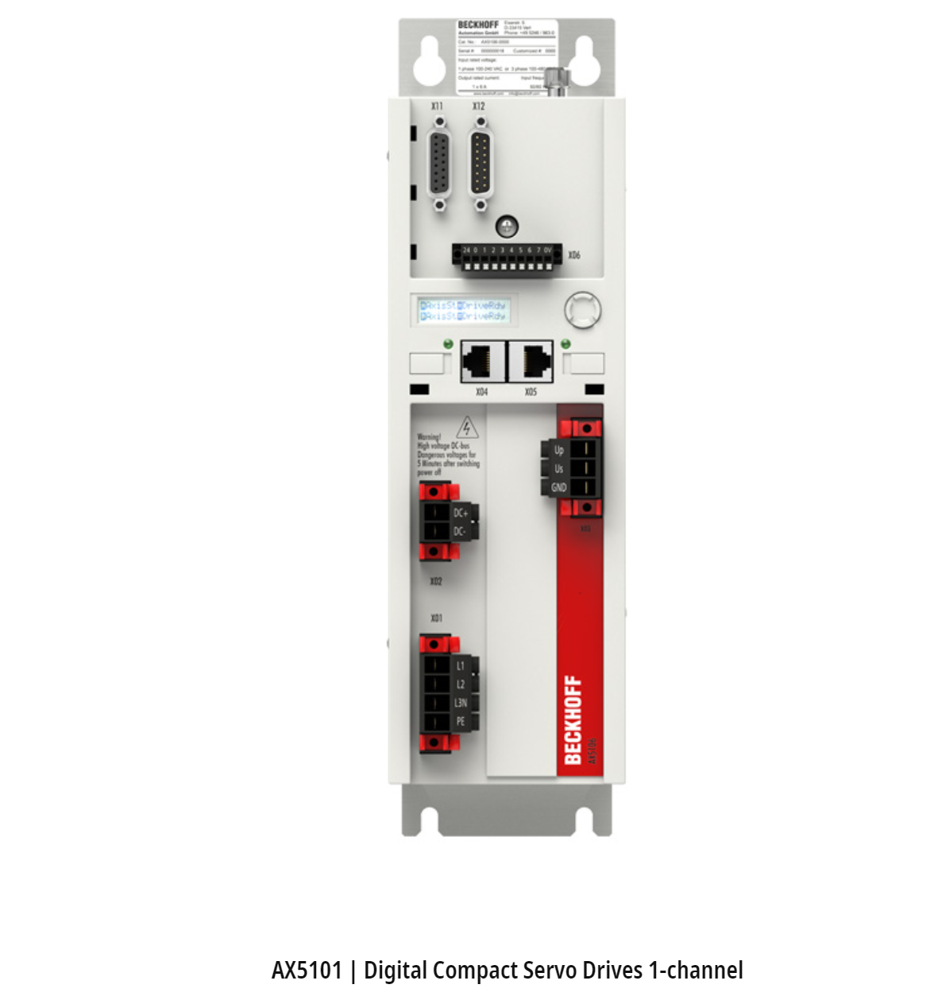

# Beckhoff AX5101

## Introduction

This short guide reviews the Beckhoff AX5101 drive and discusses how to get it working with GBEM. 

AX5000 drives are available with current capacities from 1.5 A to 170 A. They are a sophisticated EtherCAT servo drive.

Drives support a nice feature that they support a wide range of input voltages - 1 x 100 VAC - 1 x
240 VAC - 3 x 100 VAC - 3 x 480 VAC.

Has built in intergaces to teh common encoder interfaces (Sin/Cos, EnDAT, Hiperface, BiSS, Resolver etc.)

he AX-Bridge quick-connect system is pretty handy to speed and tidy up the connection for multiple axes.

also do dual channel drives

£1200 roughly

raneg fo encoder option cards EnDat 2.1 , Hiperface , BiSS B , SinCos 1 Vpp , Resolver, EnDat 2.2 , BiSS C

 multi-axis systems the drives can be coupled in the DC link, so that they can exchange energy

itec plugs or m23 speedtec on motors

nice te connectivity connectors - they are just about diy wireabled but you need a couple of the TE connectivity crimp tool which is made of solid gold and costs a billion euros. beckhoff a bit funny with warrenty when using your own custom cables 

 nice acessories motor chokes, 

abs mutiturn encoders

electromagntic brake options

bit limite on shaft options

oct one cable technology - pretty handy motors have one combined feedback/power connector not the usual two

AM8xxx series motors - flanges 40mm-to-194mm - torque 0.2Nm-to129Nm

devloped by fertig a jv between beckhoff and ex ELAU people.
