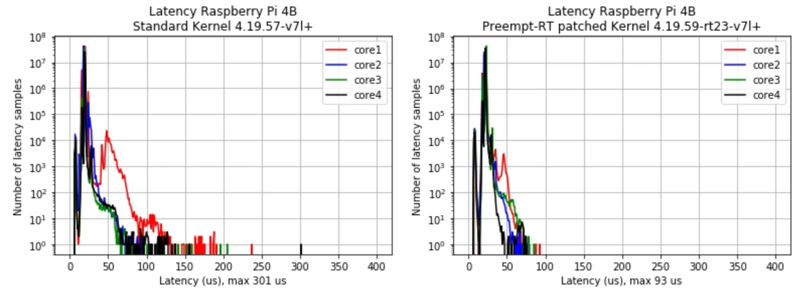

# FAQ

## EtherCAT

Can I read an SDO whilst reading/writing PDOs in real-time?

: SDO read/writes are supposed to be used to configure a slave and diagnose issues. All the SDO functions are blocking and will not work in the cyclic task. It is possible to read SDOs in a lower priority thread but this is not recomended. 

What is the "Slave Information Interface" (SII)?

: This contains nearly the same information as is available in the  slave device description XML file and is the way for a master to discover a slave's configuration. It is possible to generate the slave's SII contents (EEPROM) from the slave's XML file. https://github.com/synapticon/siitool 

Why doesn't GBEM "ingest" the slave ESI files?

: Some EtherCAT masters ingest the slave ESI files of the slaves that you are going to use, then you scan the network to see what slaves are on the network and then you select which you want adding to the device tree in the master's GUI and hey-presto the slaves appear and you can edit their PDOs, set their SDOs and configure other settings. That is great but GBEM is for programmers and they want to express things in code not in a GUI integrated with a strange IDE so GBEM expresses the EtherCAT configuration as code.

## Stepper motors

What is the difference between unipolar and bipolar stepper motors?

: Bipolar stepper motors have 4 connections Uinpolar stepper motors have 5, 6, or 8 connections. Bipolar stepper motors are "better" in that they have more torque and are more efficient but are more complicated to drive. 6 or 8 connection motors can have their coils joined to make bipolar motors.

What types of EtherCAT slaves work with GBEM?

: Any

What is the maximum number of drives allowed?
: This is defined by MAX_NUMblah. The dpm interface is constrained to x

What is the maximum number of slaves allowed?
: This is defined by MAX_NUMblah. The dpm interface is constrained to x

What is minimum cycle time?
: Depends on hardware and exactly how things are set-up. Start at 4ms and move to 1ms. Good hardware below 1ms.

How realtime is Linux realtime?

: Take a look at [osadl](https://www.osadl.org/Individual-system-data.qa-farm-data.0.html) the results are very good. You would expect a sub 50 microseconds latency.

How do I handle slaves with 32-bit time register?

: Fiddle around in main.c

What does the slave watchdog do?

: if GBEM doesn't chat with the slaves every x ms their watchdogs will kick in.

Why don't you SDO write to the slaves using complete access mode?

: We have found it difficult to work out if slaves can handle complete access mode, so it is better to use the single index method everywhere.

What is the EtherCAT state machine?

: EtherCAT slaves have their own internal state machine. As GBEM boots the network it takes each of the slaves on the network up through their state machine to the OP state.

````mermaid
stateDiagram-v2
    Init-->Pre_operational
    Safe_operational-->Init
    Operational-->Safe_operational
    Safe_operational-->Operational
    Operational-->Init
    Pre_operational-->Init
    Pre_operational-->Safe_operational
    Safe_operational-->Pre_operational
    Safe_operational-->Init
    Operational-->Pre_operational
    Init-->Operational
````


What does blockLRW do?

:  You can block LRW using ` ec_slave[slave_number].blockLRW = 1;` This is used if you are in the position that you have a slave with no LRW capability. This is most likely to be a slave a TI Sitara processor. It also means its eeprom is programmed incorrectly in that it does not set the LRD/LWR only flag which will inform the master not to use LRW.  (LRW is logical read write, LRD is logical read)

How do you read is slave's "register"?

: `ec_FPRD(ec_slave[1].configadr, ECT_REG_XXXX, sizeof(myvar), &myvar, EC_TIMEOUTRET);`

Can I run GBEM without patching the kernel?

: Yes it should just about work but you will need a long (4ms+) bus cycle time. As you can see in the graphs below the standard Linux kernel gives latencies of around 300us. 

What are the EtherCAT commands?

: The full list of EtherCAT commands are:

| Cmd  | Abbreviation | Name                               | Description                                                  |
| :--- | :----------- | :--------------------------------- | :----------------------------------------------------------- |
| 0    | NOP          | No Operation                       | A slave ignores the command.                                 |
| 1    | APRD         | Auto Increment Read                | A slave increments the address. A slave writes the data it has read to the EtherCAT datagram if the address received is zero. |
| 2    | APWR         | Auto Increment Write               | A slave increments the address. A slave writes data to a memory area if the address received is zero. |
| 3    | APRW         | Auto Increment Read Write          | A slave increments the address. A slave writes the data it has read to the EtherCAT datagram and writes the newly acquired data to the same memory area if the received address is zero. |
| 4    | FPRD         | Configured Address Read            | A slave writes the data it has read to the EtherCAT datagram if its slave address matches one of the addresses configured in the datagram. |
| 5    | FPWR         | Configured Address Write           | A slave writes data to a memory area if its slave address matches one of the addresses configured in the datagram. |
| 6    | FPRW         | Configured Address Read Write      | A slave writes the data it has read to the EtherCAT datagram and writes the newly acquired data to the same memory area if its slave address matches one of the addresses configured in the datagram. |
| 7    | BRD          | Broadcast Read                     | All slaves write a logical OR of the data from the memory area and the data from the EtherCAT datagram to the EtherCAT datagram. All slaves increment the Position field. |
| 8    | BWR          | Broadcast Write                    | All slaves write data to a memory area. All slaves increment the Position field. |
| 9    | BRW          | Broadcast Read Write               | All slaves write a logical OR of the data from the memory area and the data from the EtherCAT datagram to the EtherCAT datagram; all slaves write data to the memory area. BRW is typically not used. All slaves increment the Position field. |
| 10   | LRD          | Logical Memory Read                | A slave writes data it has read to the EtherCAT datagram if the address received matches one of the FMMU areas configured for reading. |
| 11   | LWR          | Logical Memory Write               | Slaves write data to their memory area if the address received matches one of the FMMU areas configured for writing. |
| 12   | LRW          | Logical Memory Read Write          | A slave writes data it has read to the EtherCAT datagram if the address received matches one of the FMMU areas configured for reading. Slaves write data to their memory area if the address received matches one of the FMMU areas configured for writing. |
| 13   | ARMW         | Auto Increment Read Multiple Write | A slave increments the Address field. A slave writes data it has read to the EtherCAT datagram when the address received is zero, otherwise it writes data to the memory area. |

What is the working counter?

: The Working Counter is incremented if an EtherCAT device was successfully addressed and a read operation, a write operation or a read/write operation was executed successfully. Each datagram can be assigned a value for the Working Counter that is expected after the telegram has passed through all devices. The master can check whether an EtherCAT datagram was processed successfully by comparing the value to be expected for the Working Counter with the actual value of the Working Counter after it has passed through all devices.

| Command                        | Success    | Increment |
| :----------------------------- | :--------- | :-------- |
| Read command                   | No success | No change |
| Reading successful             | +1         |           |
| Write command                  | No success | No change |
| Writing successful             | +1         |           |
| Read/write command             | No success | No change |
| Reading successful             | +1         |           |
| Writing successful             | +2         |           |
| Reading and writing successful | +3         |           |
