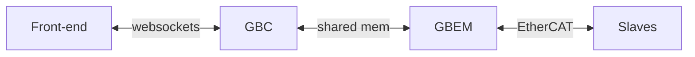
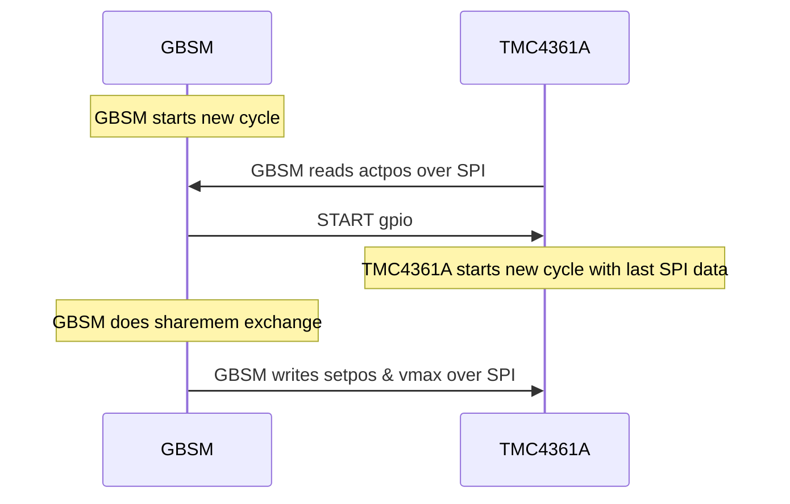

# mermaid test

```mermaid
flowchart LR
    id1["Front-end"]<-->|websockets|id2[GBC];
    id2 <--> |shared mem| id3[GBEM];
    id3<-->|EtherCAT|id4[Slaves];
```

```mermaid
sequenceDiagram
Note over GBSM: GBSM starts new cycle
TMC4361A->>GBSM: GBSM reads actpos over SPI 
GBSM->>TMC4361A: START gpio
Note over TMC4361A: TMC4361A starts new cycle with last SPI data
Note over GBSM: GBSM does sharemem exchange

GBSM->>TMC4361A: GBSM writes setpos & vmax over SPI

```