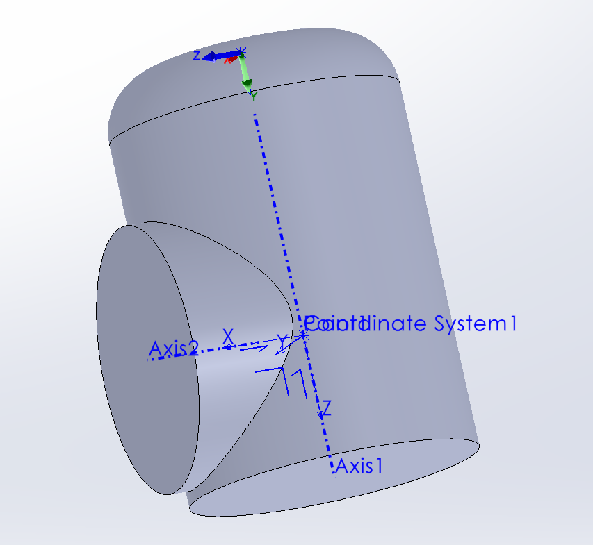

# Co-ordinate systems for AW parts

## Bases

Point = centre of base

Z axis = cylinder axis

X&Y axis = arbitrary

## Joints

These need two parts creating:

* one with the origin on the moving flange
* one with the origin on the fixed flange

## Origin on moving flange

Point = centre of moving flange
Z axis = rotation axis
X axis = alligned with fixed flange
Z+ = towards moving flange
X+ = towards fixed flange

## Origin on fixed flange

Point = centre of fixed flange
Z axis = fixed axis

## Clamps

## Flanges

## Monobraccios

## Links

Z axis = cylinder axis
X&Y axis = arbitrary

## Spindles
