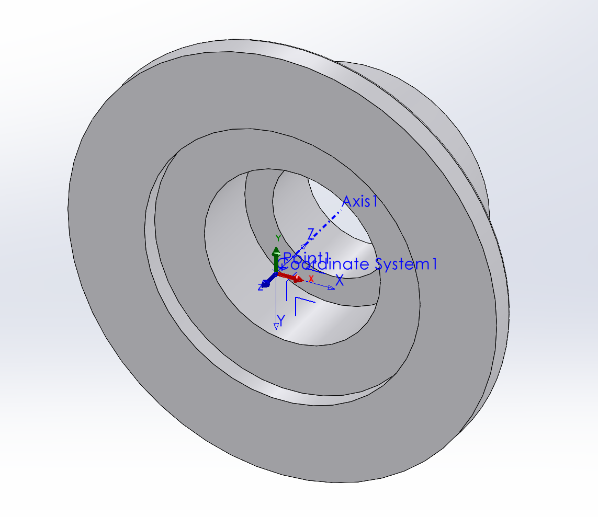

# Co-ordinate systems for AW parts

## Bases

Point = centre of base

Z axis = cylinder axis

X&Y axes = arbitrary

## Joints

Point = centre of intersection of axes

Z axis = rotation axis

X axis = alligned with fixed flange

Z+ = towards moving flange

X+ = towards fixed flange

## Clamps

Point = centre of "smaller" flange

Z axis = cylinder axis

X&Y axes = arbitrary

Z+ = away from "larger" flange

## Flanges

Point = centre of "larger" flange

Z axis = cylinder axis

X&Y axes = arbitrary

Z+ - away from tube

## Monobraccios

Point = centre of mating face of large flange

X axis = alligned with plane through two axes

Y axis = allinged with axis through flanges

X+ = towards smaller flange

Y+ = out of part into joint

## Links

Point = centre of face of end of tube

Z axis = cylinder axis

X&Y axis = arbitrary

Z+ = arbitary

## Spindles

Point = centre of mating flange

Z axis = cylinder axis

X&Y axes = arbitrary

Z+ = out of robot

